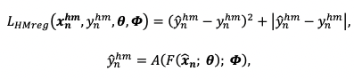
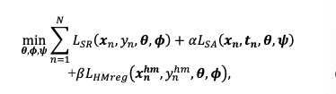

## Action quality assessment with ignoring scene context

### 1、Motivation

3DCNN中包含了丰富的背景信息，这会影响模型对AQA任务对效果。如何让模型可以忽略无用的场景信息呢？作者提出引入两个损失解决这一问题。

(把人遮起来，过往的模型还可以表现的很好，说明他其实学到了很多背景信息)

### 2、Method

本文的方法是在C3D-AVG之上修改的，原始的损失函数可以写为：

作者在此基础上加入了scene adversial loss和human-masked regression loss

#### 2.1 scene adversarial Loss

这一损失的作用是阻止模型去学习哪些场景相关的信息

R表示梯度反转层GRL，𝜆是超参数。这个损失比较简单。这里的真实标签为体育馆的类别

#### 2.2 human-masked regression loss

这一损失的作用是希望模型在评分的时候忽略掉场景信息。方法是希望模型能够无法定义那些把人物盖住的动作实例。

在这里，作者将人物被盖住的视频的真实得分设置为0

#### 2.3 optimization

最终的损失定义如下：

### 3、Experiment

是不是说明其实主要是HMreg在起作用？对于HMreg来说，其本质上滤掉的会不会不只是场景信息？

