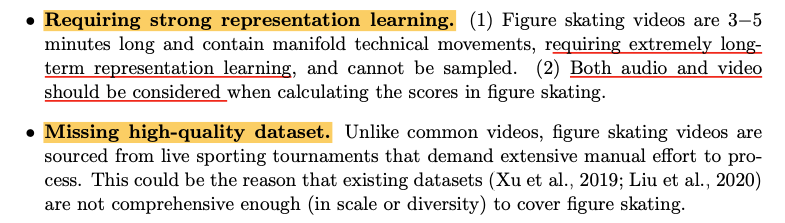
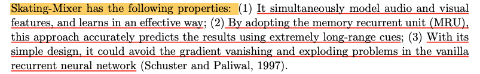
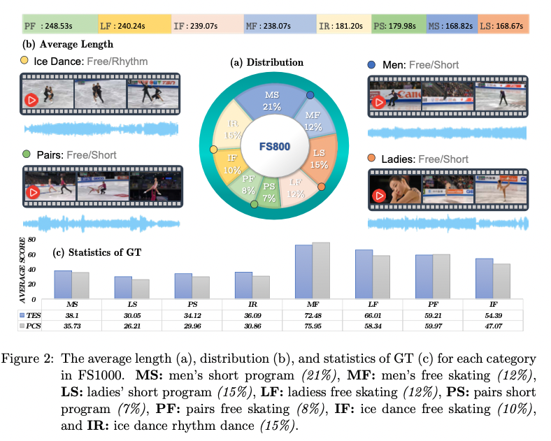
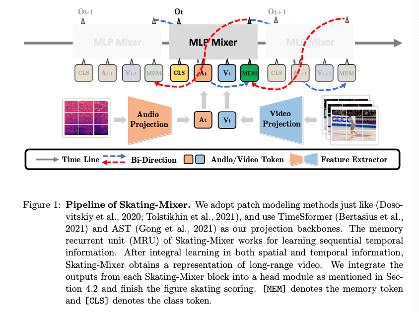
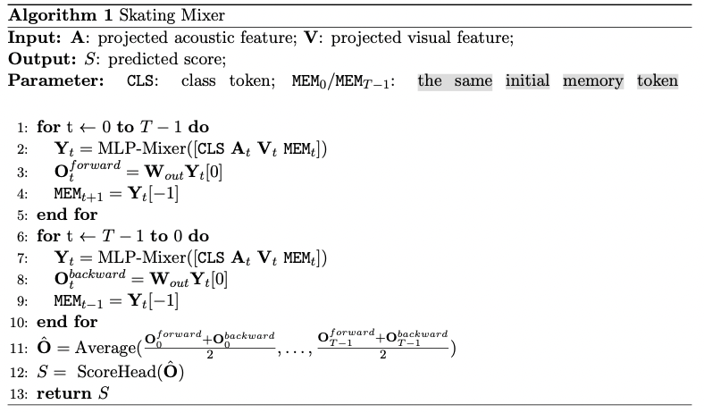
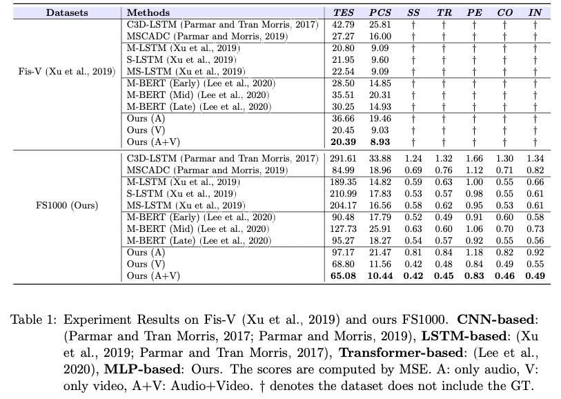
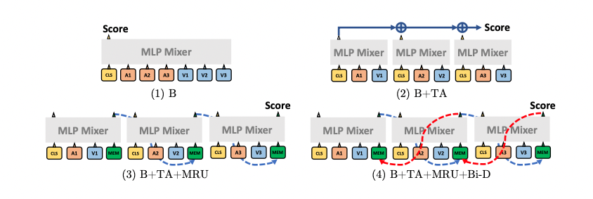
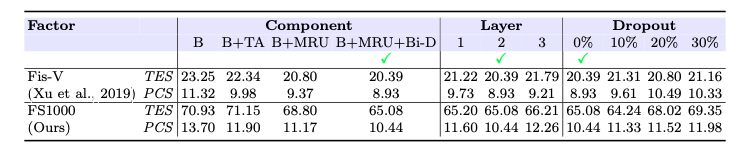
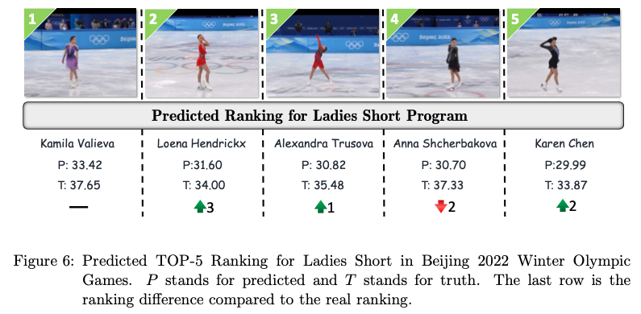

## Audio-Visual MLP for Scoring Sport

### 1、Motivation

这应该是一篇2022刚放出来的要投TCSVT的文章

在过往的研究中，只有很少的工作关注到对figure skating videos进行assessment，作者认为主要原因是：

虽然过往的研究提出了一些不错的方法，但他们都没有关注到听觉信息，但事实上，对于滑冰比赛来说，视听信息的融合是非常重要的。基于这些问题，作者提出了一个新的数据集FS1000，并设计了一个基于MLP-Mixer的模型。

### 2、Dataset

TES——Technical Element Score：表示难度和表现分

PCS——Program Component Score：总体表现，包含 the Skating Skills (SS), Transitions (TR), Performance (PE), Composition (CO), and Interpretation of music (IN)五个方面

### 3、Method

作者的这个设计很像Bi-LSTM的设计，但是相比于LSTM，MLP-Mixer更具有优势：

LSTM makes the model focus on important parts of input and thus reduces the effective input length to avoid the gradient problem.

Gradient vanishing and exploding issues could be mitigated since there is skip-connection within channel-mixing and token-mixing MLP block and no extra projection is implemented for memory token.

### 4、Experiment

#### 4.1 comparison results

在setting上，M-BERT使用了A+V其他的过往的方法只有V。

#### 4.2 Ablation study

#### performance on test set

The result shows that although the score may not be accurate, the top-5 ranking does not change too much compare to real ranking because top-tier athletes share some similar technique moves and maintain high-quality performances.