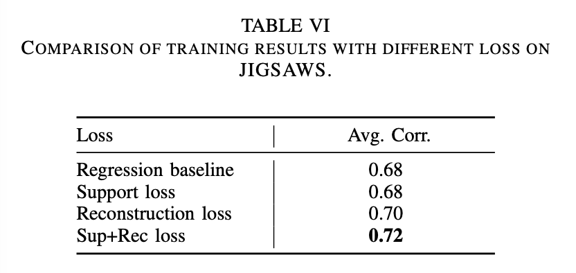

## Auto-Encoding Score Distribution Regression for Action Quality Assessment

### 1、Motivation

USDL将分数转换为分布的时候人为制定了一个标准差σ。但事实上，不同的动作会有不同的σ。如果动作很传统那么裁判的给分可能会比较稳定，但如果动作很新颖，裁判的给分就会有较大的变化。

此外，USDL将AQA问题从回归问题转换为分类问题，输出向量的维度是固定的，比如[0, 100]中的整数。这样它就没办法预测80.5这样的分数。这导致分数的预测是不连续的。

因此，作者引入了变分自编码器（VAE）的思想，提出了分布自编码器（DAE）。DAE的分数预测是连续、细粒度的，且方差是自适应的。同时，对于单任务和多任务的AQA数据集。

### 2、Approach

#### 2.1 video feature extraction

首先把完整视频下采样成n个clips，每次clip帧数相同。对每个clip，使用I3D提取特征，然后将所有clip得到的特征做average pooling得到finel feature。

#### 2.2 auto-encoder for distribution learning

自编码器将final feature编码成score distribution，最后的结果由这个分布采样得到。

架构上，分别使用一个MLP来得到$μ(x)$和$σ^2(x)$。

USDL将分数转换为一个离散的高斯分布，相当于将回归问题转换为分类问题。但这篇文章不同的是，作者将action score看做一个随机变量，用网络来预测一个分布，并根据这个分布来采样action score。

对于一个输入的特征x，VAE的前半部分会根据x生成一个随机变量y的高斯分布：
$$
p(y;\mu(x),\sigma^2(x))=\frac{1}{\sqrt{2\pi\sigma^2(x)}}exp(-\frac{(y-\mu(x))^2}{2\pi\sigma^2(x)})
$$
在获取真实分数的时候，为了模拟不确定性，作者引入了一个辅助变量$\epsilon$，分数y的计算方法如下：
$$
y=\mu(x)+\epsilon*\sigma^2(x)
$$
其中，$\epsilon$由标准正态分布N(0,1)采样得到。**我觉得这个方法很妙，非常好地模拟了不确定性。但是有个疑问是，为什么这里加上的值是方差而不是标准差？**

损失函数方面，作者采用了两部分损失：
$$
L_{sup}=\frac1 N \sum^N_{i=1}(\mu_i-g_i)^2
\newline
L_{rec}=\frac1 N \sum^N_{i=1}(y_i-g_i)^2
\newline
L=\alpha L_{rec} + \beta L_{sup}
$$
由于没有给$\sigma$加任何约束，因此其很可能会接近0，为了防止这个现象，作者提到了一个方法，一开始没有看懂这个方法。

但是实验部分给出了一段解释：Reconstruction loss is used continuously in training and combined loss is used every ten epochs. 意思是rec loss每一轮都在使用，但是combined loss每十轮才使用一次。**这个操作的作用在哪里呢？**

#### 2.3 DAE-MT

这一部分介绍了对于多任务学习问题，DAE应该如何设计

### 3、Experiment

这篇文章给出了不同数据集上最优模型的选择策略：On MTL-AQA data, we selected the highest score as our method final performance during training. On JIGSAWS data, the final performance is averaged for the best ten consecutive scores to compare with previous methods, which is different from MTL-AQA data.

**Comparison with SOTA**

数据上的结果不做叙述，鲁棒性的证明比较优参考价值。由下图可以看出DAE收敛后更稳定。此外，纵轴采用了对数的形式表示，这是一个可以学习的点。

**Different distribution**

**Case study**

**Variation range of variance**

这个关于方差的分析还是很有意思的，但是好像不太会看这个图。

**Loss Ablation study**

当只用sup Loss的时候，取μ为最终的分数。这时候模型退化为简单的回归模型。

在实验中作者发现，引入多个loss以后模型的性能和收敛速度会有提升，而且方差的稳定性也得到提高。

