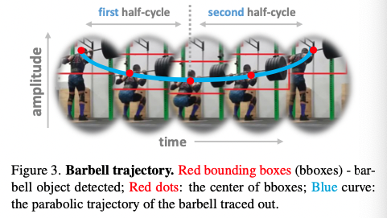
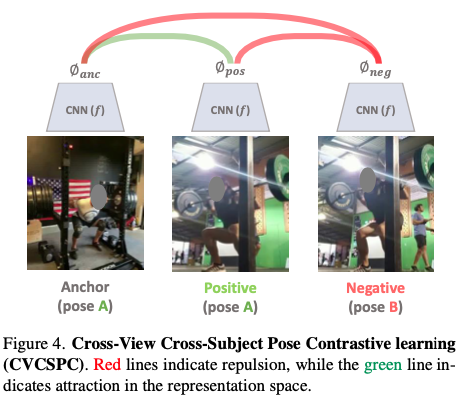
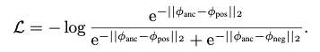
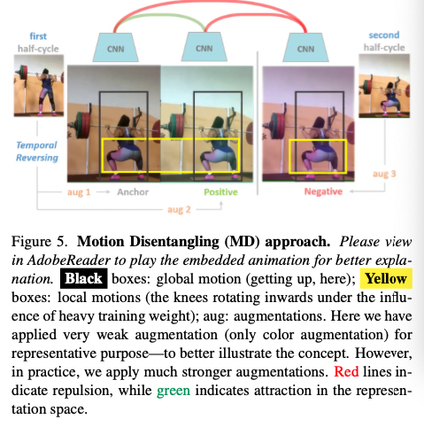
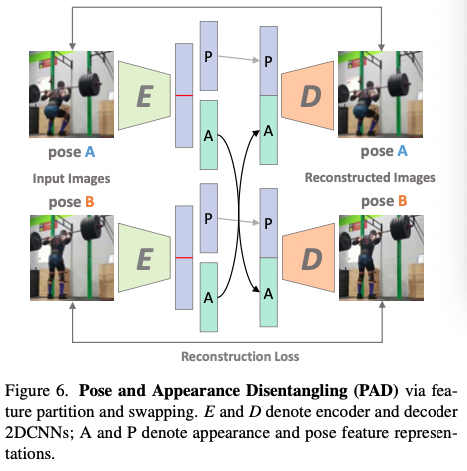

## Domain Knowledge-Informed Self-Supervised Representations for Workout Form Assessment

### 1、Motivation

体育锻炼动作的准确与否决定了是否会受伤以及有没有很好的锻炼效果。但目前很火的健身app并没有帮助用户检测锻炼效果的功能。而专门请一个教练来看也不够经济且方便。因此，如果有一个模型能够自动地帮助你判断锻炼的情况那就再好不过了。

而评判动作的好坏是需要感知人体姿态的，但现有的2D、3D姿态估计模型在真实的健身房环境中由于遮挡、视角等问题常常达不到很好的效果。因此，作者提出了使用domain knowledge的自监督方法来学习丰富的人体姿态信息。

### 2、Approach

以举重深蹲动作为例，作者首先对每个视频的杠铃做检测，这样就可以得到每个视频的杠铃运动轨迹，呈现近似抛物线的形状。

因为同样类别的动作具有类似的完成情况，因此可以将杠铃的高度标准化（我猜，最高点记为1，最低点记为0），这样就可以用高度来搜索不同视频的不同片段。

#### 2.1 Self-supervised pose contrastive learning

首先，对于某个视频选出的anchor frame，在其他视频中选取杠铃标准化高度与之相同的正例帧，再选取高度不同的负例帧，构成三元素$\{I_{anc},I_{pos}, I_{neg}\}$。通过2D CNN得到三元组对应的三元特征$\{\phi_{anc},\phi_{pos}, \phi_{neg}\}$。希望anchor和正例之间的距离尽可能接近，两者跟负例之间的距离尽可能远。因此，有如下损失

#### 2.2 Self-supervised motion disentangling

作者针对健身房锻炼任务做了一些假设：锻炼的动作通常是对称的，用一个动作“拉起”就会用相反的动作“放松”。同时，人们的错误常常出现在其中某一半片段中，不会出现在整个动作过程中。因此，对于前一半的视频，可以通过反转并增强他得到anchor和positive的后一半视频，并与原本negative的后一半视频共同构成三元组，仿照上面的训练范式进行训练。

#### 2.3 Self-Supervised Pose and Appearance Disentangling

