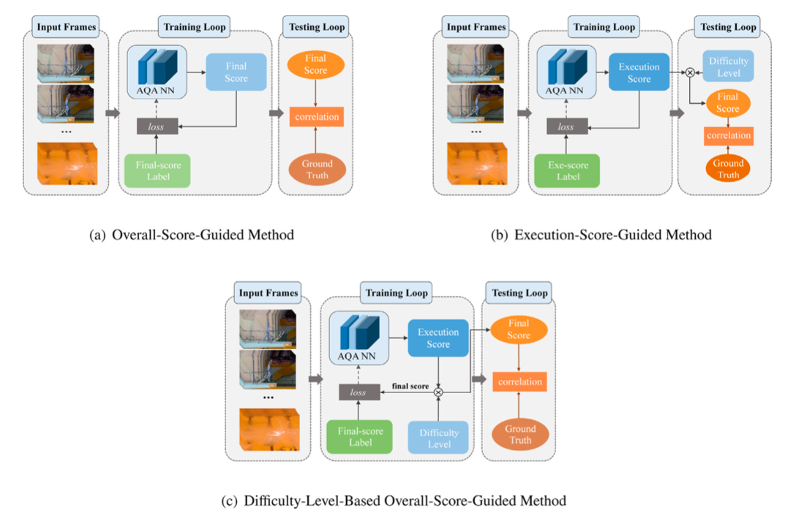
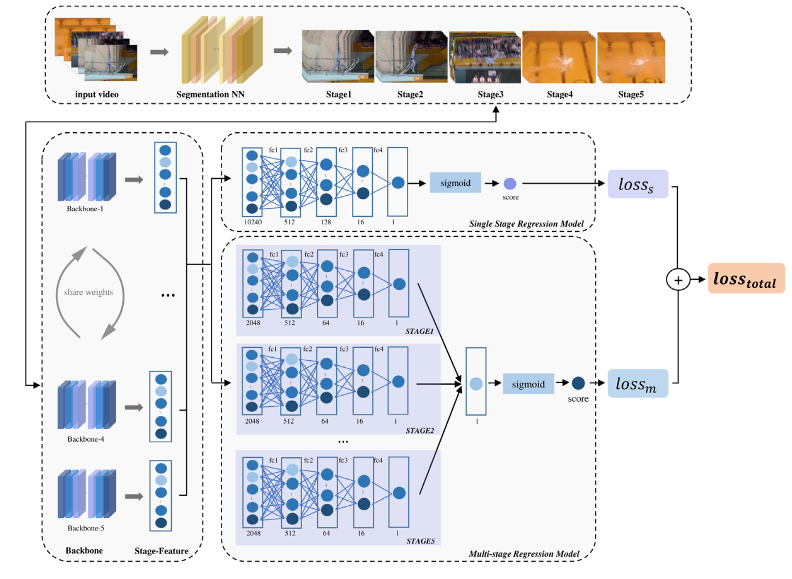
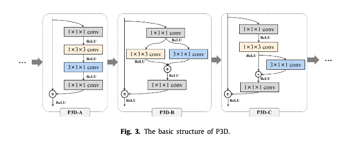
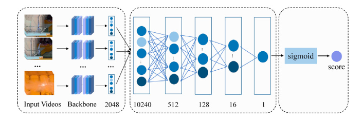
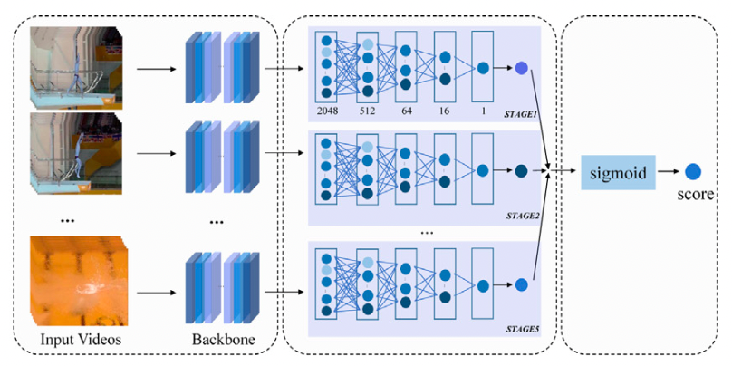
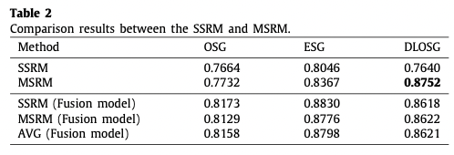
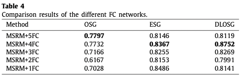
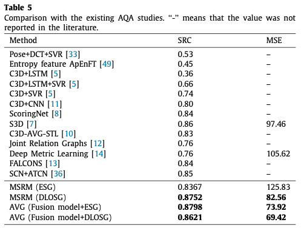
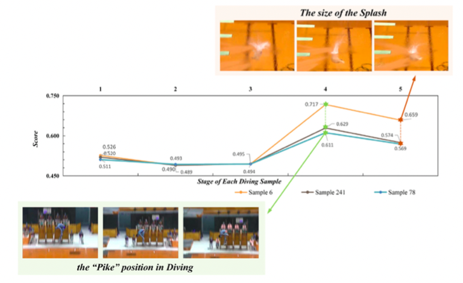

## Learning and fusing multiple hidden substages for action quality assessment

### 1、Motivation

虽然过往的AQA模型表现很不错，但是仍存在一些问题：1）过往的模型直接建模了视觉特征与分数标签的关系。忽略了其分数的来源规则（表现分*难度分）；2）AQA需要考虑一些专业知识，比如一个动作中有多个子步骤， 每个步骤都会对表现分有一定的作用。

因此，作者设计了一个能够对多个hidden substages的动作质量进行建模并融合的模型。

### 2、 Problem definition

 According to the objective evaluation rules of diving, three assessment scenarios are defined: **the overall-score-guided scenario**, **execution-score-guided scenario**, and **difficulty-level-based overall-score-guided scenario**.

**不太理解b和c的区别在哪里。**

看了下面损失的设计好像有点明白了。对于训练的一个batch来说，b是简单的将所有得到的表现损失做平均，而c是将所有得到的表现根据难度系数加权平均。因此是不是会更倾向于对难度更大的动作进行优化呢？

### 3、Approach

该模型包括三个部分：temporal segmentation model (TSM), feature representation model (FRM), and score regression model (SRM).

#### 3.1 temporal segmentation

作者用ED-TCN模型将diving动作分成5个substages，对应5个segment，写作$V=\{p_1,...,p_5\}$。

#### 3.2 feature representation

作者使用P3D作为特征提取器，P3D基本block如下所示：

5个segments得到的特征表示为F={$f_1,...,f_5$}。

#### 3.3 score regression

过往回归分数的方法有early fusion和late fusion两种。也对应作者设计的两种回归module。

对于SSRM，作者采用了early fusion。模块的输出作为overall score，记为$S_s$。

对于MSRM，作者采用late fusion。每个分支首先回归出每个stage对应的分数，然后将其concat起来并通过最后的FC层得到最后的分数，记为$S_m$。

#### 3.4 loss function

训练的损失对应上面提到的三个scenario。n表示第n个样本，那么

对OSG scenario：
$$
loss^{osg} = \frac 1 N \sum^N_{n=1}(S_n^o −G^o_n)^2
$$
对 ESG scenario：
$$
loss^{esg} = \frac 1 N \sum^N_{n=1}(S_n^e −G^e_n)^2
$$
对DLOSG scenario：
$$
loss^{dlosg} = \frac 1 N \sum^N_{n=1}(S_n^e*G_n^{dl} −G^e_n*G_n^{dl})^2=\frac 1 N \sum^N_{n=1}((S_n^e −G^e_n)^2*{G_n^{dl}}^2)
$$
最终的损失是由SSRM和MSRM两个模块分别对三个场景进行计算得到的：
$$
loss^i_{total} = loss^i_s + loss^i_m , i = osg , esg , dlosg
$$
在测试的时候，会评估三个分数的效果：SSRM (Fusion model), MSRM (Fusion model) and AVG (Fusion model)。

### 4、Experiment

#### 4.1 Ablation study

非fusion model就是单独对三个场景进行训练。会发现MSRM的表现会比SSRM好，说明sub stage确实有点东西。

另外，回归表现分而不是最终得分的效果会更好。我认为这是因为回归表现分更简单。

如果把三个场景和起来训练，那么在OSG和ESG上会有明显的提升，虽然DLOSG受到另外两个场景的影响有所下降，但是也下降的并不明显。

因为文章用了不同于过往工作的FC，因此在这里也做了消融实验。发现总的来说4层FC效果最好。

#### 4.2 comparison with SOTA methids

#### 4.3 qualitative analysis

水花确实关键。

**emmm感觉好像也没有很牛逼0.0**