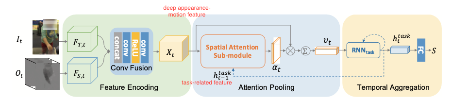
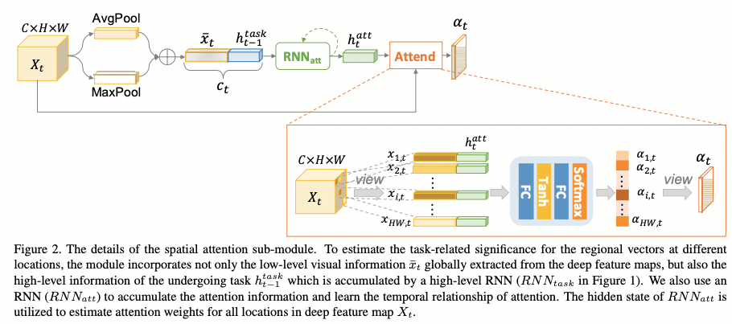
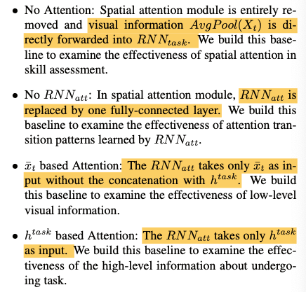
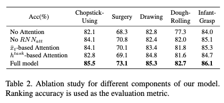
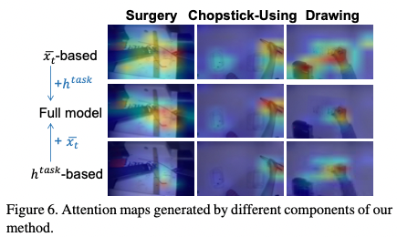

## Manipulation-skill Assessment from videos with spatial attention network

### 1、Motivation

过往的方法大多是task-specific的，缺乏繁华能力，并且无法获取很细粒度的动作信息。

对于一个动作视频，理想的模型应该在看视频的时候能够关注到三方面的信息：1）每一帧的视觉信息、2）正在进行的动作信息、3）当前时刻前面帧的所有信息

因此，作者设计了一个RNN-based model。模型主要包含两个RNN。其中一个建模spatial attention在时间维度上的变换；另一个建模当前看到的部分。

### 2、Approach

### 2.1 model architecture

给定一个完成某一任务过程的完整视频，模型对其动作表现进行评估，最终得到一个评分。

#### 2.2 feature encoding

一个视频被分成了N个segment，从每个segment中随机选取一帧$I_t$和堆叠的optical flow $O_t$作为模型的输入。用两个ResNet101提取特征后送入ConvFusion模块。得到 fused deep appearance-motion representation $X_t\in\R^{C\times H\times W}$。

#### 2.3 attention pooling

对于每个time step t，Attention Pooling层的输入包含两部分：1）对应time step的deep appearance-motion feature maps（low-level information）；2）下一个模块传回来的hidden state（high-level information）

对于输入1），对其分别做max pooling和avg pooling并相加得到高度抽象的low-level representation vector $\bar x_t\in\R^C$。
$$
\bar x_t=AvgPool(X_t)+MaxPool(X_t)
$$
将两者concat起来得到attention模块的输入$c_t=[\bar x_t;h^{task}_{t-1}]$。这里的attention模块包含两部分，一个RNN结构$RNN_{att}$以及一个attention结构。

在每个time step，RNN维护一个状态向量$h_t^{att}$。其更新规则为：
$$
h_{att}=RNN{att}(c,h^{att}_{t-1}).
$$
得到这部分RNN的输出后，attention计算模块计算attention map：
$$
a_{i,t} =ω^T_a[tanh(W_{xa} x_{i,t} +b_{xa} +W_{ha}h^{att}_t+b_{ha} )]
\space\space,
i = 1, 2, ..., H × W ;
\newline
\alpha_t=softmax(a_t)
$$
其中$x_{i,t}$为每个时间步特征图X拉平后的每个点的特征向量。

最后，对输入的特征图加权求和得到attention pooling层的输出。
$$
v_t = \sum^{H\times W}_{i=1}\alpha_{i,t}x_{i,t}
$$

#### 2.4 temporal aggregation

这部分相对简单，通过$RNN_{task}$获取high-level信息，然后接一个FC头完成分数的回归。
$$
h_{task}^t =RNN_{task} (v_t,h_{t-1}^{task}).
\newline
S=FC(h_N^{task})
$$

#### 2.5 training

训练方面沿用了之前研究中用到了对比学习ranking的方法，这里就不做很多赘述了，详细的可以看whos better那篇文章。

### 3、 Experiment

我觉得这篇文章比较有意思的点是那个高低层次信息融合的部分。图像transformer中是否也可以引入这样的机制呢？