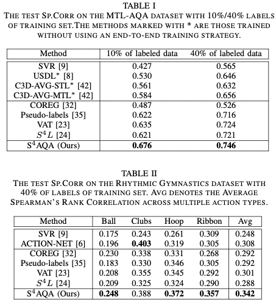

## Semi-Supervised Action Quality Assessment with Self-Supervised Segment Feature Recovery

### 1、 Motivation

过往的AQA方法太依赖于多规模标注的数据集，却几乎没有工作关注半监督的方法。

从直觉上，一个动作的表现会收到每个stage的制约。比如说，如果运动员跳水跳出了很大的水花，那么肯定是前面出现了失误。而如果他前面一段表现很好，中间一段未知，而最终有很大的水花，那么他中间肯定出现了失误。而预测这种中间动作的表现有助于模型在无标签的情况下学会对动作质量进行建模。

因此，作者的方法是首先用一个encoder和decoder预测被mask住的feature来让模型学会动作质量表示。然后用有标签数据学会如何回归分数。最后用一个对抗学习模块将有标签和无标签数据的特征分布拉近。

### 2、Approach

#### 2.1 problem formulation

Our goal is to learn to assess the quality of the action performance by exploiting both the labeled and the unlabeled samples.

两类数据的特征可以表示为：$V^l = [v_1^l,v_2^l,...,v_t^l,...,v_T^l ]$和$V^u = [v_1^u,v_2^u,...,v_t^u,...,v_T^u ]$。

#### 2.2 Learning Action assessment on labeled videos

对于有标签的数据，将clip特征送入一个encoder以后用fc进行回归得到分数。这跟过往的方法基本一致。

#### 2.3 learning temporal dependencies on the unlabeled videos

对于无标签数据，作者用了自监督的方法进行学习。

对于无标签视频的特征$V^u = [v_1^u,v_2^u,...,v_t^u,...,v_T^u ]$，从中随机选择第k个segment的feature，将其mask起来得到$\ddot V^u$。然后通过跟有监督数据共享权值的encoder得到中间特征$\ddot f^u$。在这之后，尝试用一个decoder还原被mask住的特征，并用Mean-Absolute-Error loss来控制模型的学习。(decoder被设计为双层带ReLU激活的FC)

#### 2.4 aligning the representation distributions

由于sampling bias和不同的损失设计，有标签和无标签数据通过encoder以后得到的特征可能会存在不对齐的现象。因此，作者引入了一个对抗训练的机制将两者对齐。

假设有标签数据得到的中间特征分布为为class1，无标签的为class0。用一个discriminator $D(.)$尝试对中间特征进行判别，而encoder尝试混淆discriminator。因此，这个min-max对抗优化问题可以写为：

在训练的时候，作者使用了梯度反转层来训练encoder和decoder。因此，最终的adversarial loss可以写成：

综上，$S^4AQA$最终的损失可以写为：

### 3、Experiment

#### 3.1 comparison with SOTA

COREG效果不好作者分析是因为他是非参数模型，比较难学。S4L效果表现不好是因为里面用了很多视频旋转的数据增强，这使得模型比较难学习

action-net里面有复杂的注意力机制和GCN，因此取得了不错的表现。而作者的模型仅用简单的设计就取得了很不错的效果。

#### 3.2 Ablation study

主要验证mask recovery module和distribution alignment module的作用。

看起来MSFR模块应该是起到主要作用的，而RDA模块又可以进一步提升性能。其实可以发现，仅仅是AA+MSFR就已经打败了其他模型。

将无标签的数据根据分数可视化出来，可以发现随着模块的加入，特征点的分布越来越合理。

**两个疑问：**1）为什么AA+MSFR效果都已经很好了还想得到要加入RDA？2）可视化的图是怎么画出来的？

#### 3.3 further analysis

**损失前面加的系数有没有什么直觉？**