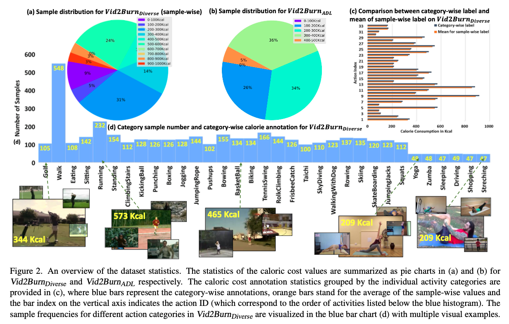

## *Should I take a walk?* Estimating Energy Expenditure from Video Data 

### 1、Motivation

虽然有一些穿戴设备可以测出人运动时的卡路里消耗，but sensors are not always present at hand or comfort- able to wear, most people can easily access a video camera in their phone or laptop.

对于energy estimation这个事情来说，主要面临两个阻碍：

- Our task however requires ***fine-grained* understanding of human movement**
- encourage the model to **capture the essence of energy expenditure** instead of memorizing average values of specific activity categories seen during training. 

好像跟AQA差不多，首先是要关注人物本身，其次是关注energy expenditure而不是简单的在动作内做平均。同时，作者希望模型达成的另一个目标是：great *generalization* to previously unseen types of activities

### 2、Vid2Burn

作者收集了一个新的数据集，叫Vid2Burn。

在这个完整的数据集上，作者将其分成了两个子集：

- **ViD2Burn-Diverse**：其中包含的是一些运动比较剧烈的，比较好用过过往方法测算GT的动作。这些动作的背景会比较多变，有各种各样的场景
- **VID2Brun-ADL**：这个子集里包含的动作背景比较单一，都是在相似的场景里拍摄的。而动作也是日常出现的动作，比如穿衣服、喝水。

**标注方面：**

- **ViD2Burn-Diverse**：首先查表看了Diverse子集中动作的平均卡路里消耗，如下所示

在此之后，使用movement的剧烈程度调整这个均值（文中的**Body movement- based annotations.** ）

- **ViD2Burn-ADL**：将Heart-rate based annotations.和Body movement- based annotations结合起来

**测试策略方面：**

作者设计了两种testing scenarios：*Known activity types* evaluation和*unknown activity types* evaluation

具体的策略可以直接看文章，很好理解。

### 3、Activity Recognition Models in the Context of Caloric Cost Estimation

为了学到连续的卡路里分布，作者采用了跟USDL一样的策略。

实验部分就是跑一下各种backbone，暂时没发现很多可以挖掘的部分

不过对可视化比较好奇，怎么可视化激活情况呢？