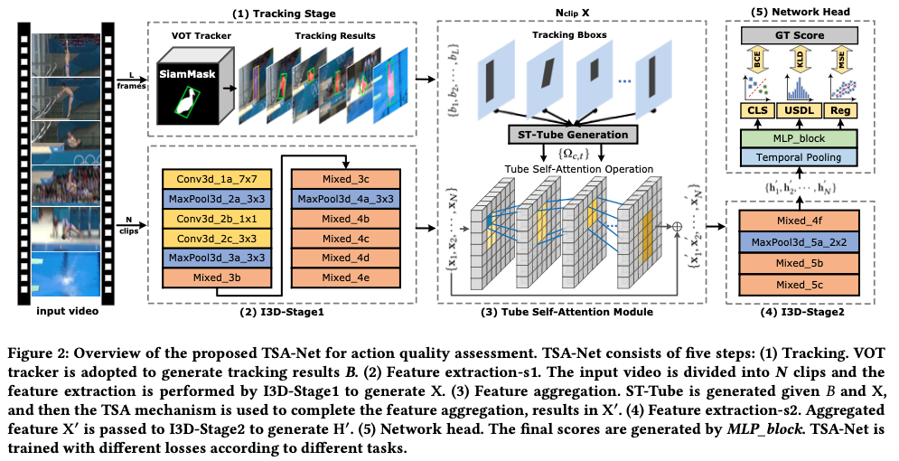

## TSA-Net: Tube Self-Attention Network for Action Quality Assessment

### 1、Motivation

绝大多数现存的AQA方法只是将动作识别的方法迁移过来，但忽略了feature map之间隐含的内部差异，比如说前景和后景的关系。因此，不加调整地将动作识别的方法迁移到AQA是不合适的。

此外，现有的方法无法很好地将特征融合起来。卷积对感受野的限制让长距离的关系难以建模。因此，An effective and  efficient feature aggregation mechanism is desired in AQA task。

因此，为了让模型关注到更多有用的动作信息，而忽略无关的信息入观众、广告，作者设计了Tube Self-Attention  module（TSA）。其优势在于：①high efficiency：visual object tracking架构让tube mechanism只关注feature map的一部分，相比于non-local，减少了计算开销；②effectiveness：self-attention机制保存了有用的时空信息而避免了冗余；③flexibility：可以即插即用在多种视频网络上。

### 2、Approach

#### 2.1 Overview

对于输入的L帧视频，首先使用SiamMask获取目标跟踪的结果$B=\{b_l\}^L_{l=1}$。然后将视频分成N个M帧的clips，送入I3D stage1提取特征$X=\{x_n\}^N_{n=1}$，$x_n=\{x_{n,t}\}^T_{t=1}$。

此后，将tracking boxes和feature map作为TSA模块的输入完成特征融合。将最终的融合特征送入I3D stage2中做进一步处理，最终输出的就是对运动员动作质量的表征，最后针对不同的数据集设计不同的网络头完成AQA任务。

#### 2.2 Tube Self-Attention Module

TSA与Non-Local最大的区别在于TSA可以根据tracking boxes的信息对要做self-attention的feature做选取，而忽略无用信息。TSA模块包括两个步骤：

**①spatial-temporal tube generation**

由于I3D stage1中包含pooling的操作，因此得到的feature map和b-box之间**时序维度上**的关系并不是一对一而是一对多，而且SiamMask提取到的b-box是倾斜的。因此要完成对应的操作会存在一些难题。作者提出了如下图所示的解决方案：

由于在I3D stage1上得到的特征图与原视频时间维度上的关系为1：4，因此，首先对每一帧根据B-box生成相应的mask，再将连续的mask叠加起来得到最终的mask。$b_l$关于$x_{c,t}$的mask $M^l_{c,t}$用公式表示为：

其中S为是$b_l$覆盖住feature对应grid的区域根据阈值来标识为0 or 1，论文中说阈值τ=0.5**（这个地方一定要看看代码是怎么实现的）**。而四个这样的mask组合就得到了最终的mask：

为了方便，mask被表征为一个position set

而$|Ω_{c,t}|$标识被选中的feature数量。

**②tube self-attention operation**

这一部分跟non-local很像，但又有不同。

用公式表示为：

where
$$
C(x)=\sum_c \sum_t |Ω_{c,t}|
\newline
f(x_p,x_{c,t}(i,j))=\theta(x_p)^T\phi(x_{c,t}(i,j))
\newline
x'_p=W_zy_p+x_p
$$
C(x)表示一个视频需要被计算的所有特征向量的总数，$f$为相似度计算函数，最后还要加入跳连。**【用自注意力的思路理解这一部分】**

这个公式表示了输出的特征图每个点对应的向量的计算方法。用p来标识当前计算的点的位置（c,t,i,j)**【注意这里的c是clip的意思，$x_p$是一个向量】**。

与non-local对比，由于只需要计算mask=1对应的部分，因此复杂度由$𝑂 ((𝑁 ×𝑇 ×𝐻 ×𝑊) × (𝑁 ×𝑇 ×𝐻 ×𝑊))$降为了$O(( \sum_c \sum_t |Ω_{c,t}|  )×( \sum_c \sum_t|Ω_{c,t}| ) )$

#### 2.3 Network Head and Training

为了适应不同的数据集，作者设计了三种头：分类、回归、分布预测。分类头用来做动作分类，回归头做分数回归，分布预测参考USDL。

### 3、Experiment

评价指标：Spearman秩相关系数，计算平均表现的时候使用Fisher z-value。

Baseline: 将TSA换成Non-Local就是baseline。

#### 3.1 Results on AQA-7 dataset

除了Snowboard，NL-Net和TSA-Net的效果都超过了其他模型。之所以snowboard不好作者分析是因为在这个运动的视频中人物的size太小了，难以捕获信息。具体可见figure 5。

由于TSA的输出和输入的size是相同的，因此可以叠加很多层TSA结构。多层的TSA结构可以捕获更丰富的信息，因此2层的时候表现最好。但是到了3层的时候表现有所下降，作者认为这是因为出现了过拟合的关系。

此外，作者还做了计算开销分析。从下图可以看出，TSA-Net的计算开销有大幅度的降低，但是模型的效果却有所提升。

#### 3.2 Results on MTL-AQA dataset

在此TSA-Net的表现不够好作者分析是因为MTL-AQA数据集的视频具有更高的分辨率和更广的视野。这导致了更小的ST-Tube从而影响performance，但这样的影响不大。当然，也可以通过增加TSA的层数来提升性能，且保证较小的计算开销。

#### 3.3 Results on FR-FS Dataset

**case study ：**

橙色表示plain-net，灰色表示tsa-net。可以发现，由于自注意力机制的存在，TSA-Net可以focus on表现特别的部分（比如摔倒）。**此外，值得注意的是，作者在这里将global average pooling删掉以后分析了每个clip的结果。这个方法可以学习的一下。**

#### 3.4 Analysis and visualization

在体育比赛的视频中，运动员和摄像头高速的移动可能会导致pose detection的效果很差。比如由于帧模糊无法识别或者识别到观众而非运动员。FineGym那篇文章也提出了类似的观点。因此，作者认为基于pose estimation的方法并不太适用于AQA in sports scenes。

visualization的结果可以直接看上面的figure 5。

【评价】：这篇文章新颖的地方在于没在I3D提取到的特征上做文章而是在I3D得到的中间的特征图做文章，而且考虑了pose estimation的局限性，引入了video object tracker。

唉。。。AQA真的越来越难做了。
