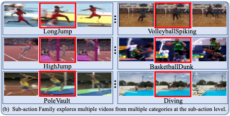
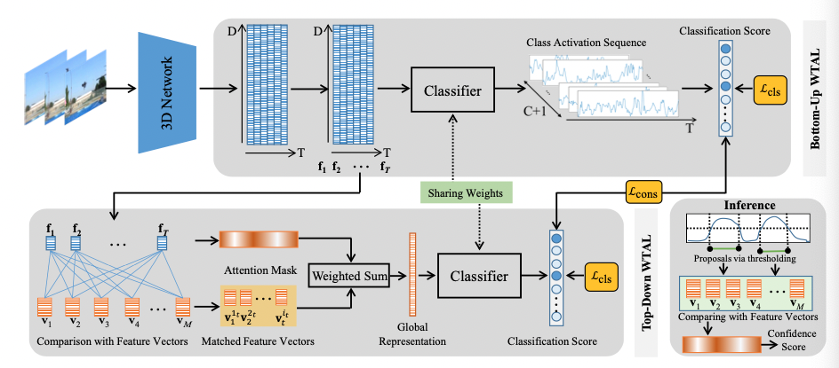
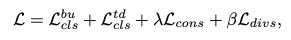
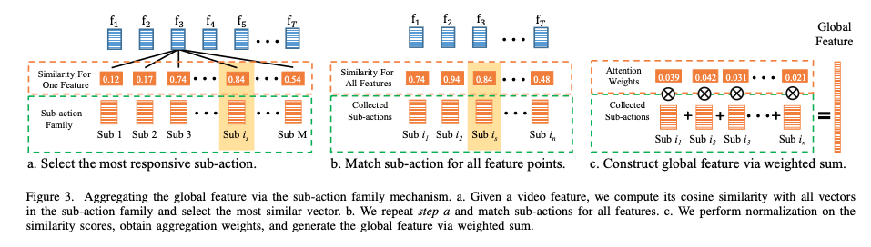
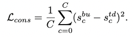
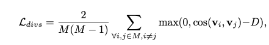
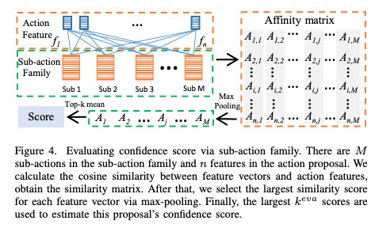

## Exploring Sub-Action Granularity for Weakly Supervised Temporal Action Localization

### 1、Motivation

作者观察到不同动作具有相似的子动作。因此是否可以让模型学到这些子动作从而方便动作定位呢？

### 2、Method

#### 2.1 problem definition

对于一个数据集，每个视频包含一个类别label $y=[y_0,y_1,y_2,...,y_C]$，其中C表示总的动作类别数，$y_0$表示背景信息，$y_c\in\{0,1\}$表示对应的动作是否在视频中出现。WTAL任务希望模型能通过这些video-level的标签，学到对每个动作实例的开始、结束时刻以及动作的类别进行判断。

#### 2.2 baseline

这篇文章的模型是在BaS-Net的基础上做的，上图就是BaS-Net的结构图，该文章提出的模型相当于将其注意力模块用sub-action family替换了。

#### 2.3 Sub-action family in network

**buttom-up**

buttom-up部分的操作跟BaS-Net基本一致（好像在《Weakly-supervised Temporal Action Localization by Uncertainty Modeling》中也是这么做的）。最终得到的分类score 表示为：$S^{bu}=[s^{bu}_0,...,s^{bu}_C]$。将分数softmax归一化以后，损失计算为：
$$
L^{bu}_{cls}=-\sum^C_{c=0}y_clog(\hat s^{bu}_c)
$$
**top-down**

sub-action family V包含M个特征向量$[v_1,...,v_M]$。对于得到的特征$F=[f_1,...,f_T],f_t\in\R^D$，在送入top-down 部分的时候，对于每个f，将其与sub-action family的M个特征向量做对比，选出一个最相关的，那么最后就会选出一系列feature（小于等于T个）。将这些feature加权求和得到global feature representation（具体见2.4）。最后进行分类得到最后的分类score $S^{td}=[s^{td}_0,...,s^{td}_C]$。损失的计算跟上面一致，最后得到的损失记为$L^{td}_{cls}$。

**consistency loss and diversity loss**

用这样一个损失来保持两个branch的分类结果一致，引入了consistency loss。为了保证Sub-Action Family的特征多样性，引入了diversity loss。（具体见2.5）

因此，最终的训练损失计算表示为：

#### 2.4 sub-action family representing

这里介绍sub-action family mechanism是如何运作的。

a：对于每个从视频中得到的特征f，计算其与所有sub-action family vector的**余弦相似度**。并选中其中相似度最大的。

b：对于选出的n个与视频特征最相近的sub-action family vectors，对他们的分数做softmax归一化。（b中的collected sub-actions中应该是有T个选出的vector，原因是有T个视频特征，这里面的vector可能会重复）

c：最后，将这些特征加权求和得到最终的global representation。

#### 2.5 sub-action family training

**consistency loss**

**Diversity loss**

对于M个feature vectors，一共会有M(M-1)/2种组合，因此损失可以设计为：

设计一个margin D是有道理的，因为其实有一个可以容忍的区间，不可能让所有的vectors都不相同。

妙啊！！！

#### 2.6 sub-action family assisted inference

测试期间，通过和Sub-Action Family的相似度矩阵来计算confidence score，该方法对于proposal的长度变化更为鲁棒。

对于一个proposal，计算相似度的时候可以获取到一个nxM的affinity matrix，对这个matrix按列做max pooling可以获取每个feature vector的相似度最大值，然后对这些值做topK mean得到最后的proposal confidence score。