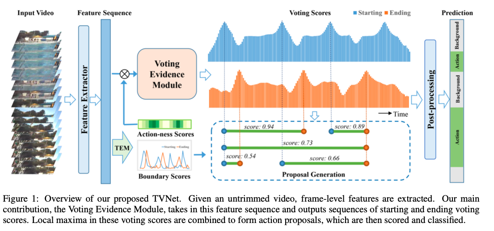
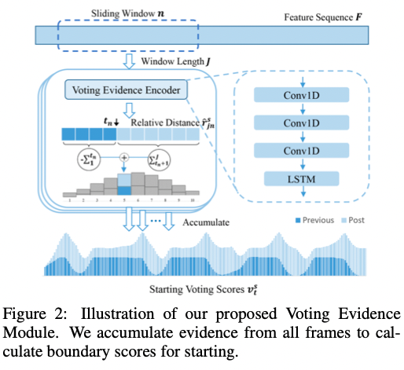
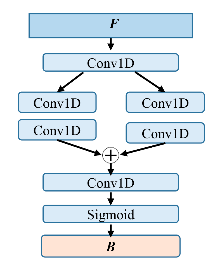
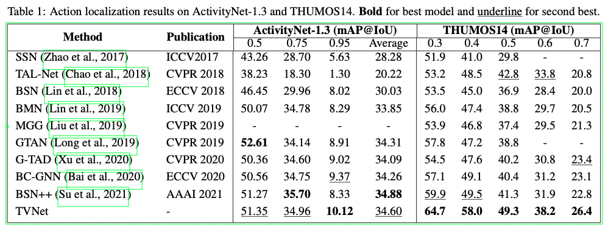
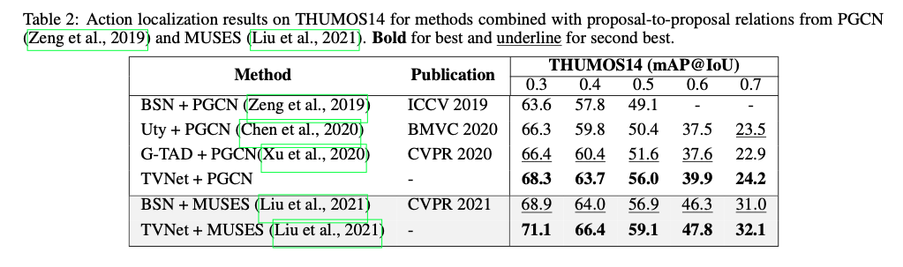
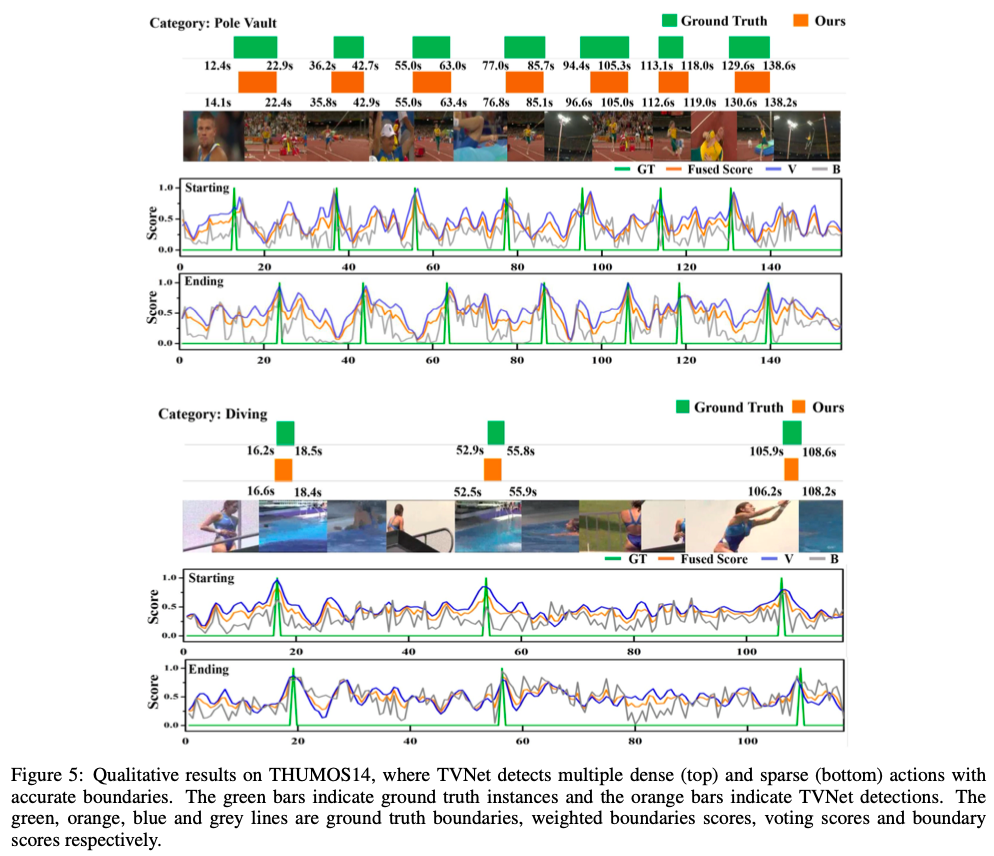
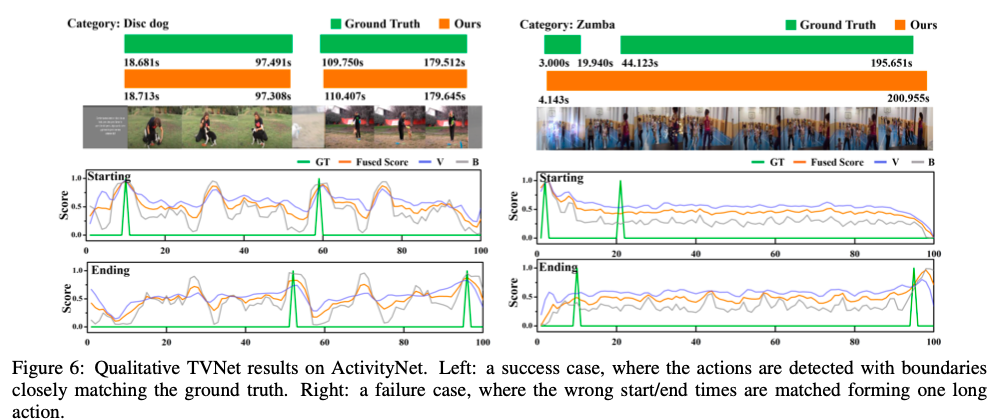
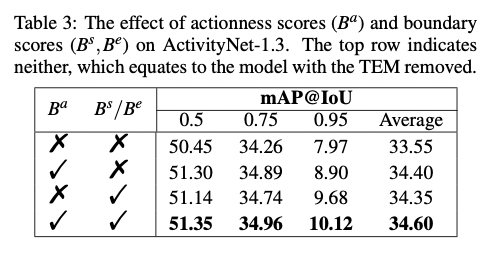
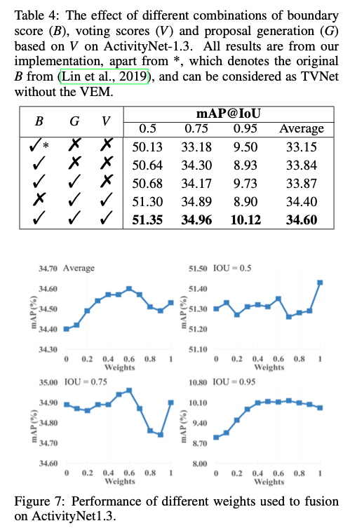

## TVNet: Temporal Voting Network for Action Localization

### 1、Motivation

在localization中引入voting的概念。

### 2、Approach

overview：

#### 2.1 Problem definition

希望模型能够对动作的boundary进行预测，同时对划分的动作进行classification。

#### 2.2 Voting Evidence Module（VEM）

首先作者提出了sign distance的概念。具体描述为：

Assume a frame is 5 frames past the start of the action. We denote this relative dis- tance ‘-5’, indicating the start of the action is 5 frames ago. In contrast, when a frame precedes the start of the action by say 2 frames, we denote ‘+2’. 

如果一个模型能够很好地进行动作定位，那么它也应该能够比较好地预测出对应帧与前后动作边界的sign distance。为了学习这种距离计算机制，作者设计了VEM。

**①Voting evidence encoder**

对于由视频得到的特征序列F，使用一个长度为J的滑动窗口对每一帧对应的特征进行编码。通过三层Conv1D和LSTM，每个滑动窗口得到输出$\hat R=\{(\hat r^s_j,\hat r^e_j)\}^J_{j=1}$，表示窗口中的每个帧j与**最近**的start/end frame之间的相对距离。关于relative distance的理解可以参考下图：

在训练的时候，用ground truth生成的distance $R=\{(r^s_j,r^e_j)\}^J_{j=1}$来指导encoder的学习。其中，$r^s_j=j-s^*,r^e_j=e^*-j$。将relative distance归一化到-1~1之间后用MES Loss来更新参数：
$$
L^s=\frac 1 J \sum^J_{j=1}(\hat r^s_j- r^s_j)^2
\newline
L^e=\frac 1 J \sum^J_{j=1}(\hat r^e_j- r^e_j)^2
$$
**②Voting accumulation**

计算到每个window对应每一帧的distance后，需要将信息进行整合、
$$
v^s_t=\sum^N_{n=1}(\sum^{t_n}_{j=1}(-\hat r^s_{jn})+\sum^J_{j=t_n+1}\hat r^s_{jn})
\newline
v^e_t=\sum^N_{n=1}(\sum^{t_n}_{j=1}\hat r^e_{jn}+\sum^J_{j=t_n+1}(-\hat r^e_{jn}))
$$
v表示voting score，其计算的是在涵盖某一位置的所有滑动窗口的relative distance关系。越高表示越可能是start或end point。可以将每个部分的score整合起来得到$V^s=\{v^s_t\}^T_{t=1}和V^e=\{v^e_t\}^T_{t=1}$。进一步可以得到porposals。

#### 2.3 Proposal getneration and post-processing

**①proposal generation**

首先预定一个分数阈值$\xi$，将分数在这个阈值之上的局部最高点作为可能的start point和end point。将时间长度小于预定的时间阈值$\tau$的start point和end point之间的区间作为proposal。得到proposal后，用每个proposal中包含的特征，在前人提出的Proposal Evaluation Module中计算直接置信度p($\hat s$,$\hat e$)

**参考文献：**<Lin, T., Liu, X., Li, X., Ding, E., and Wen, S. (2019). BMN: Boundary-matching network for temporal ac- tion proposal generation. In *International Conference on Computer Vision*.>

**②proposal confidence scores**

作者在前人的基础上改进了Temporal Evaluation Module。该模块以从视频中提取到的特征作为输入，输出的是基本starting score（$B^s$）、基础ending score（$B^e$）和actionness score（$B^a$）。

比较好奇为什么可以从某一帧来判断动作？

根据模块的输出，结合前面得到的porposal得分V和p，计算每个proposal的置信度：
$$
\hat c=(v^s_\hat s+\alpha b^s_\hat s)(v^e_\hat e+\alpha b^e_\hat e)p(\hat s, \hat e)
$$
**③redundant proposal suppression**

使用Soft-NMS移除冗余的proposals。

**④classification**

对每个候选的proposal获取类标，这部分应该是比较简单，作者也没有做很多阐述。

### 3、Experiment

dataset：ActivityNet1.3、THUMOS14

#### 3.1 Main results

上图说明了TVNet的优越。下面一幅图关于proposal-to-proposal的实验没太理解，可能需要阅读一下P-GCN那篇文章。

#### 3.2 quanlitative results

在密集和稀疏的动作视频上验证了效果。

success case和failure case的对比。文章好像缺少了对这种失败现象的解释。只是说“起码起始时间和结束时间是对的”。

#### 3.3 Ablation study

**①Effectiveness of TEM**

**②voting and boundary scores**

后面还有一些超参的消融实验，在这里不做过多阐述。

