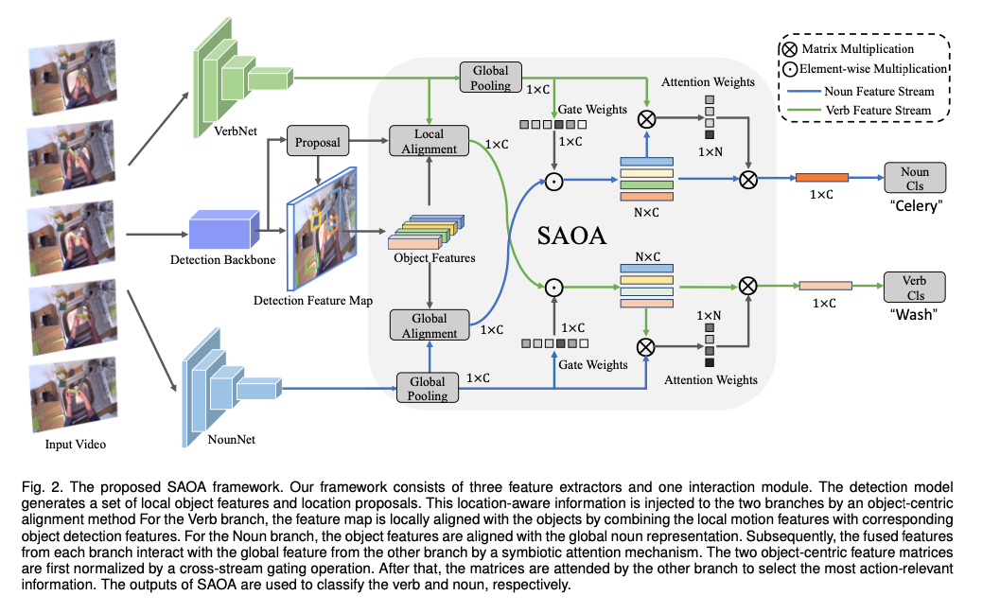
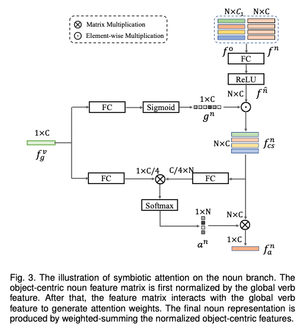
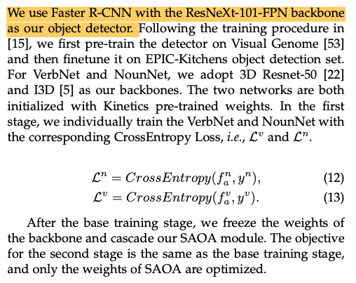
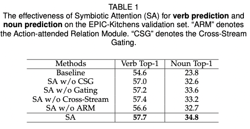
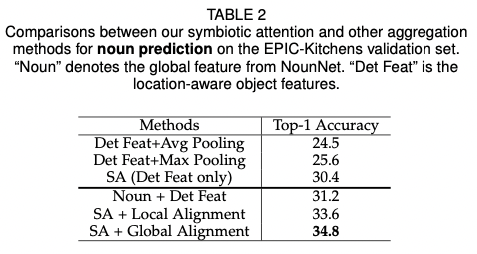
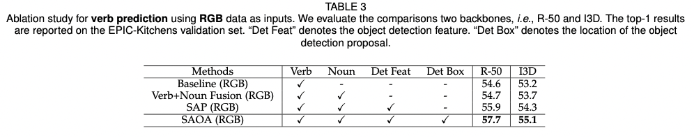
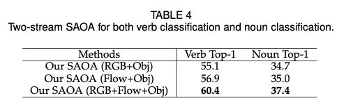
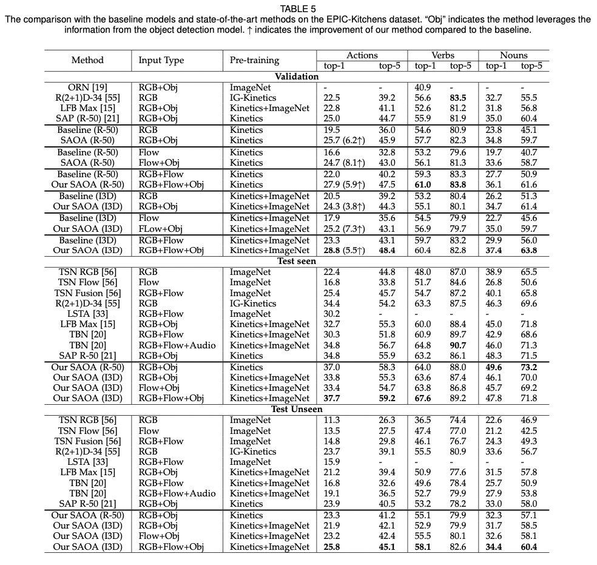

## Symbiotic Attention for Egocentric Action Recognition with Object-centric Alignment

### 1、Background

任务：egocentric action recognition。按照文章的解释，应该是第一人称的动作识别（videos captured  from a first-person viewpoint）。

egocentric action recognition要求模型去区分人正在交互的物体和其他小的物体。

数据集：EPIC-Kitchens。一个action被定义为verb和noun的结合（比如“open door”）。过往的研究中verb和noun的分类通常是分开训练的。verb branch用来对agent正在进行的行为进行分类，而noun branch则是判断出人正在交互的物体。

### 2、Motivation

过往的研究将verb branch和noun branch分开，只关注到了noun branch和object detection feature之间的交互，而没有关注到verb branch和noun branch之间的交互。然而，一个action是由动作本身和交互的物体共同表征的。即使是人类，只关注物体而忽略了行为同样也是很难预测action的。

因此，作者作出了如下贡献：

- 提出了object-centric feature alignment method将local-aware information集成到两个branches上
- 完成alignment后，得到了一系列候选的verb features和noun features。再通过一个symbiotic attention模块获取与action最相关的feature
- 做了丰富的实验验证模型效果

### 3、Approach

overview：

#### 3.1 preliminaries

使用两个3D CNN为backbones提取video clip中的verb feature和noun feature。使用Faster R-CNN提取object feature。然后使用object-centric模块将object feature和verb、noun feature分别融合。最后用symbiotic attention模块生成最后的预测结果。

#### 3.2 Object-centric Feature Alignment

之所以要设计这样一个模块，是因为3D CNN提取到的global feature maps无法很好地表征交互信息，需要引入一些local details。考虑到verb branch和noun branch之间语义信息到不同，作者设计了两种不同的机制实现特征融合。

**①global alignment for the noun branch**

因为noun branch和object feature都表征的是物体的出现情况，gap较小，所以直接使用了global alignment。

首先，对于noun feature map $f^n \in \R^{T*H*W*C}$，进行global average pooling得到$f^n_g\in\R^{1*C}$。然后通过下面的式子进行global alignment：
$$
f_i^{\hat n}=ReLU(W^nf_g^{nT}+W^n_of_i^{oT}+b^n)\space ,i\in[1...N]
$$
其中$W^n\in\R^{C*C},W^n_o\in\R^{C*C_1},b_n\in\R^{1*C_1}$。因此最终$f^{\hat n}\in\R^{N*C}$，每一行表示一个object-centric fearture。

**②local alignment for the verb branch**

对于每个$f_i^{o}$，object detection同时生成了位置信息$l_i=(x_i^0,y_i^0,x_i^1,y_i^1)$。local alignment可以表示为：
$$
f_i^v=ROIAlign(f^v,l_i)
\newline
f_i^{\hat v}=ReLU(W^vf_i^{vT}+W^v_of_i^{oT}+b^v)\space ,i\in[1...N]
$$

#### 3.3 Symbiotic Attention

这个部分将前面得到的两个branch的object-centric feature进行交互。首先使用一个门控机制将另一个branch的feature标准化，然后使用注意力机制进行融合。可以直接用下图来表示：

**①cross-stream gating**

设计这个gating的模块是为了过滤掉action-irrelevant信息，用更正确的特征指导学习。

In noun classification：
$$
f_g^v=GAP(f^v)
\newline
g^n=Sigmoid(W^n_gf_g^{vT}+b_g)
\newline
f^n_{cs}=g^n\odot f^{\hat n}
$$
In verb classification：
$$
f_g^n=GAP(f^n)
\newline
g^v=Sigmoid(W^v_gf_g^{nT}+b^v_g)
\newline
f^v_{cs}=g^v\odot f^{\hat v}
$$
**②Action-attended Relation Module**

In noun classification：
$$
a^n=Softmax(f^v_gW^a_vW^a_{cn} f^{nT}_{cs})
\newline
f^n_a=a^nf^n_{cs}
$$
In verb classification：
$$
a^v=Softmax(f^n_gW^a_nW^a_{cv} f^{vT}_{cs})
\newline
f^v_a=a^vf^v_{cs}
$$

#### 3.4 Training and Objectives

### 4、Experiment

**action calculation：**引入先验，滤掉完全不可能出现的action（如：open the knife）
$$
P(action=y)=\mu(y^v,y^n)P(verb=y^v)P(noun=y^n)
$$
**Ablation study of symbiotic attention**

为什么SA w/o CSG没有SA w/o Cross-Stream好呢？

**SA outperform other aggregation operations / The effectiveness of the global alignment for noun classification**

**The effectiveness of the local alignment for verb classification**

**Benefit of the multi-modal fusion**

**Comparison with SOTA results**

