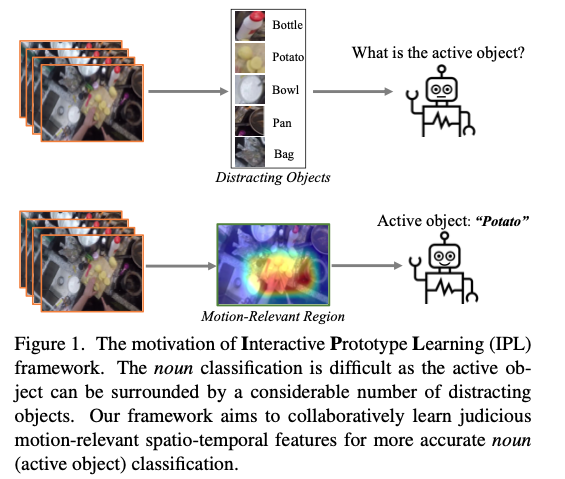
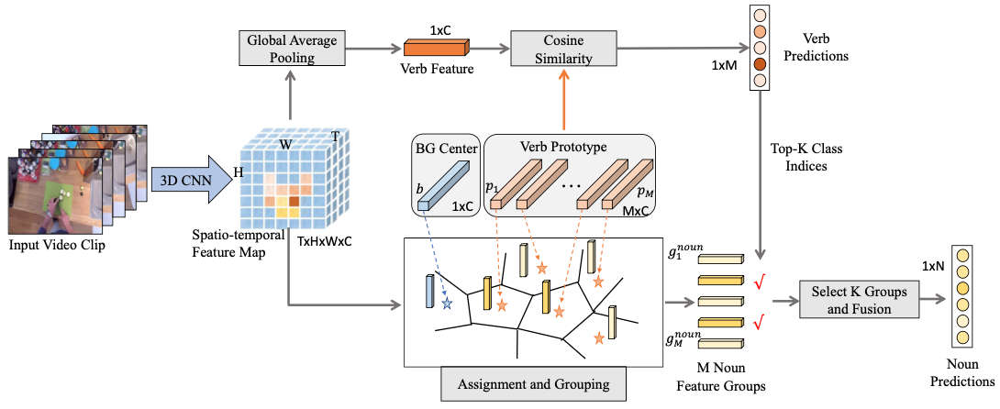
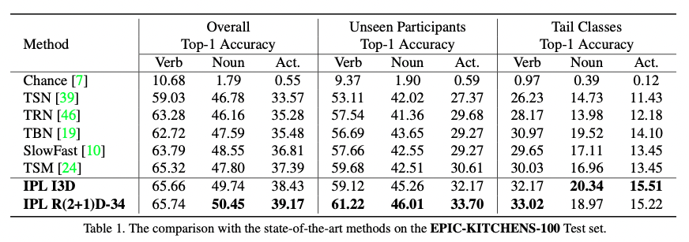
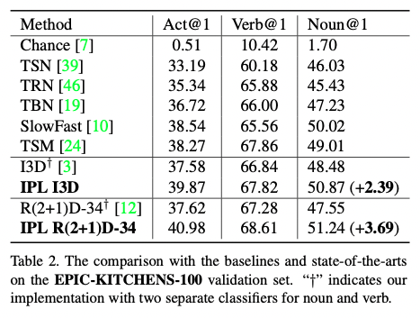
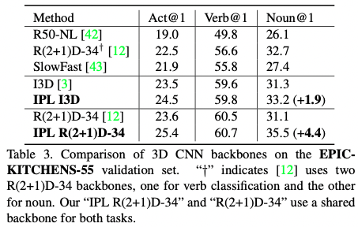
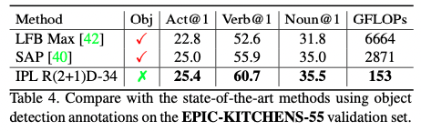
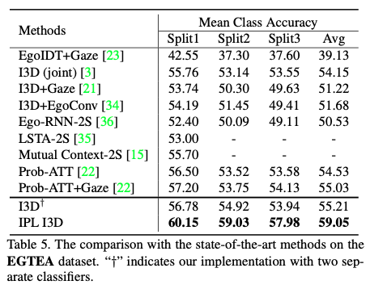
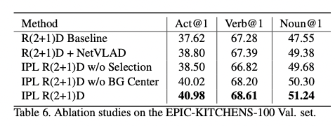
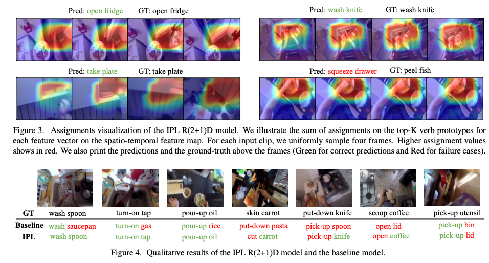

## Interactive Prototype Learning for Egocentric Action Recognition

### 1、Motivation

由于第一视角视频中会出现很多与action本身无关的物体，因此过往的第一人称动作识别方法通常需要使用object detection或是人体注视信息，这造成了较大的计算和人力开销。为了解决这一问题，作者引入actor的运动信息，设计了end2end的**interactive prototype learning（IPL）** 框架来学习更好的active objects表现。

### 2、Iteractive Prototype Learning

#### 2.1 overview

对于输入的视频clip，首先使用3DCNN提取T ×H ×W ×C的feature map。

引入了M个verb prototype表示M个verb的pattern，表示为$P=\{p_1,p_2,...,p_M\}\in \R^{M×C}$

对verb branch，对feature map进行global avg pooling得到c维度对verb feature。然后将其与M个prototype计算余弦相似度，取相似度最高的动作作为分类结果。

对noun branch，作者引入了两个交互操作让模型学习到更丰富的位置感知特征。在**noun-to-verb配准**操作中，将feature map转换为THW个C维向量，并分配至M个verb prototype外加一个background prototype中（加入background是为了滤掉无用信息）。这将THW个特征分成M+1个组。在**verb-to-noun选择**操作中，选出上面做分类时得到的top-K verb classes对应的组，将组的feature融合起来后进行最后的noun prediction。

#### 2.2 verb classification

verb branch可以用下面的式子表示：
$$
v = GAP(\phi_\theta(X))
\newline
q_i=\frac {exp(\bar v \bar {p_i} ^ T/\tau)}{\sum ^M_{j=1}exp(\bar v \bar {p_j} ^ T/\tau)}
$$
其中，$\bar v=\frac v {||v||},\bar p_i=\frac {p_i} {||p_i||}$

#### 2.3 noun classification

**2.3.1 feature assignment and grouping**

这一部分的难点在于如何将特征分配到不同的prototypes上。

这里为觉得比较妙的地方是不仅用了M个行为prototypes，还引入了与动作无关的Background prototype。我认为这可能是模型能够将非交互物体与交互物体分开的关键因素。

作者定义了一个soft assignment matrix $A'\in\R^{B \times (M+1)}$，并将feature map拉平成B个C维2D tensor构成的矩阵Z，其中B=T×H×W。A‘的计算方法如下：
$$
a_{i,j}=\frac {exp(z_i {c_j} ^ T)}{\sum ^M+1_{k=1}exp(z_i {c_k} ^ T)}
$$
完成计算后将BG prototype对应的列去掉，得到矩阵$A\in\R^{B \times M}$。

**（这个地方不太理解为什么要去掉，因为不去掉好想也没有特别大影响？）**

完成后对features进行分组：
$$
G=A^TZ
$$
我的理解是，$A^T$的i，j个元素表示对第i个verb prototype，第j个特征对应的强度。因此计算出来的G的i行表示对于第i个verb prototype，与之交互的noun所表现出的C维特征。

但是，作者认为G中既包含了action motion的信息，也包含了active object的信息。因此，进一步地，作者计算了G与P之间的加权残差：
$$
g^{noun}_i=g_i-\sum^B_{k=1}a_{k,i}p_i
$$
其中，a_{k,i}是A中的元素。

**2.3.3 group selection and noun classification**

完成上面的步骤后，最终得到$G^{noun}=\{g^{noun}_1,...,g^{noun}_M\}$

后面的分类过程比较好理解，不做详细阐述。不过值得注意的是，这里的fusion用了1D卷积+BN+ReLU的组合。**关于最后的分类方法，作者说也用了余弦相似度，但是问题是要跟什么计算余弦相似度呢？这里作者没有做很细致的阐述**

### 3、Experiment

#### 3.1 数据集

​	1.EPIC-KITCHENS-55

​	2.EPIC-KITCHENS-100

​	3.EGTEA

#### 3.2  Comparison with State of the Arts

1. EPIC-KITCHENS-100

对I3D，作者采用了RGB+optical flow。而对R(2+1)D-34则只采用RGB。

这里的baseline就是用backbone + 两个FC来分别对noun和verb进行分类。

2. EPIC-KITCHENS-55

这里作者还与用object detection的方法进行了对比。

3. EGTEA

该数据集提供了人眼注视的标注

#### 3.3 Ablation study

#### 3.4 Qualitative Results

