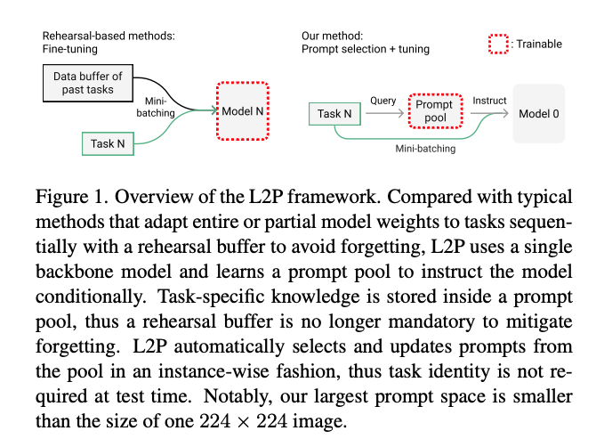
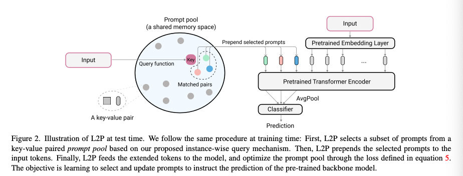
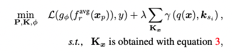
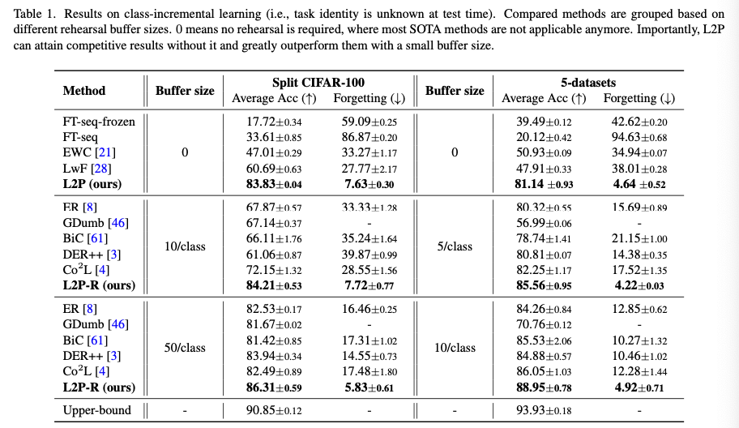
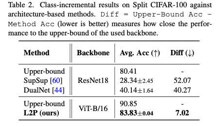
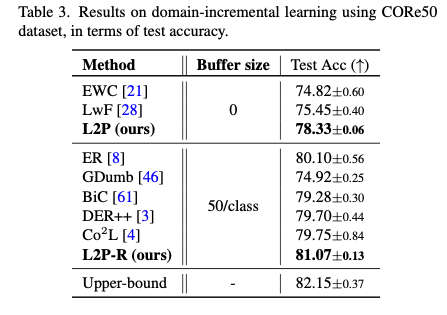
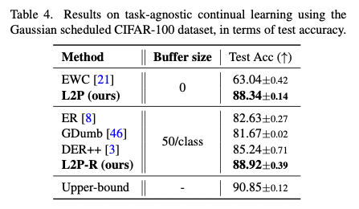
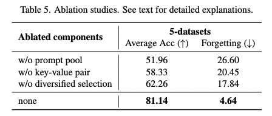
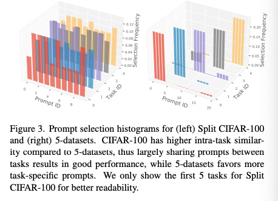

## Learning to Prompt for Continual Learning

### 1、 Motivation

作者认为当前增量学习面临两个问题：

 (1) Whether the form of episodic memory can go beyond buffering past data to more intelligent and succinct episodic memory system? 

(2) How to automatically select relevant knowledge component for arbitrary sample without knowing its task identity?

对第一个问题，作者提出使用NLP的最新训练范式prompt-based learning来解决。A prompt encodes task-specific knowledge and has the ability to utilize pre- trained frozen models more effectively than ordinary finetuning. Thus, it is promising to leverage prompts to learn knowledge, and further store learned knowledge, in the continual learning context.

对第二个问题，如果对不同的任务训练不同的prompts，那么事实上还是需要知道task identity。但如果只训练一个prompt，那么可能还是会有灾难性遗忘的问题。As a transfer learning technique, the target of prompting is to make frozen pre-trained models achieve good performance on down-streaming individually, not sequentially. There- fore, if we instead maintain a single shared prompt for all tasks, the problem of catastrophic forgetting may still exist.

为了解决这一问题，作者提出了新的增量学习方法：

instead of tuning the parameters during the continual learning process, L2P **keeps the pre-trained model untouched**, and instead **learns a set of prompts that dynamically instruct models to solve corresponding tasks**. 意思是要训练一系列prompts，而不用训练model

### 2、Approach

#### 2.1 From prompt to prompt pool

我认为下面这段描述能比较好地描述作者需要解决的问题：

**First**, the task identity at test time is unknown so training task-independent prompts is not feasible. 

**Second,** even if the task-independent prompt can be known at test time, it prevents possible knowledge sharing between simi- lar tasks. 

**Third**, while the naive way of learning a sin- gle shared prompt for all tasks enables knowledge sharing, it still causes severe forgetting issue 

Ideally one would learn a model that is able to share knowledge when tasks are similar, while maintaining knowledge independent otherwise.

基于这样的想法，作者设计了**prompt pool** $P=\{P_1,...,P_M\}$。其中，每个独立的prompt表示为$P_j\in \R^{L_p\times D}$。对于一个输入x，需要自适应地选出N个与之task相关的prompts，假设选到的prompy序列为$\{s_i\}^N_{i=1}$那么输入预训练好的Transformer Encoder的输入可以表示为$ x_p = [P_{s1} ;...; P_{sN} ; x_e], 1 ≤ N ≤ M$。

#### 2.2 Instance-wise prompt query

一个输入需要对应N个prompt，那么怎么选出这些prompt呢？为此作者设计了一个**基于key-value对的查询策略**。

将每一个prompt与一个key关联：$\{(k_1,P_1),...,(k_M,P_M)\}$，其中$k_M \in \R^{D_k}$ ，所有key的集合用K表示。

对于一个输入x，用一个query function $q:\R^{H ×W ×C}\to\R^{D_k}$将其映射到与key相同的维度。要注意的是这里的q应该是一个固定的不可学习的函数。因此用了一个已经训练好的模型来充当q。

接着，用计算query与任意N个keys之间的余弦距离之和$\gamma ()$，选距离最小的作为被选中的keys。
$$
K_x=argmin_{\{s_i\}^N_{i=1}\subseteq[1,M]}\sum^N_{i=1}\gamma (q(x),k_{s_i})
$$

**Optionally diversifying prompt-selection.**

此外，无论在实验场景还是真实场景，训练的过程中知道task边界是很正常的，因此作者也考虑加入这个先验。

在训练的过程中，维护一个prompt激活表$H_t=[h_1,...,h_M]$，其中每个值表示直到第t-1个task，对应prompt激活的**归一化频率**。为了让查询机制尽可能选到不同的prompt，将上面的式子调整为：
$$
K_x=argmin_{\{s_i\}^N_{i=1}\subseteq[1,M]}\sum^N_{i=1}\gamma (q(x),k_{s_i})\cdot  h_{s_i}
$$
这个式子仅在训练的时候使用，在测试的时候不使用。

**为什么测试的时候不用呢？**

#### 2.3 optimization

最终损失函数可以表示为:

 The first term is the softmax cross-entropy loss, the second term is a surrogate loss to pull selected keys closer to corresponding query features. λ is a scalar to weight the loss.

### 3、Experiment

**Results on class-incremental learning.**

buffer size越小，提升越明显。

**Results on domain-incremental learning**

**Results on task-agnostic learning. **

**Ablation study**

第一行是只用一个prompt去训练的结果；

第二行是将N个prompts的均值作为key，而不是定义一个key。

第三行就是把dibersified selection去掉。

**visualization**

