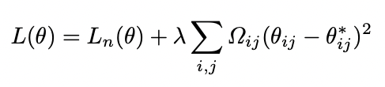
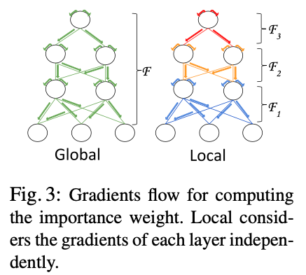
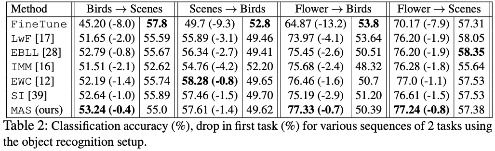
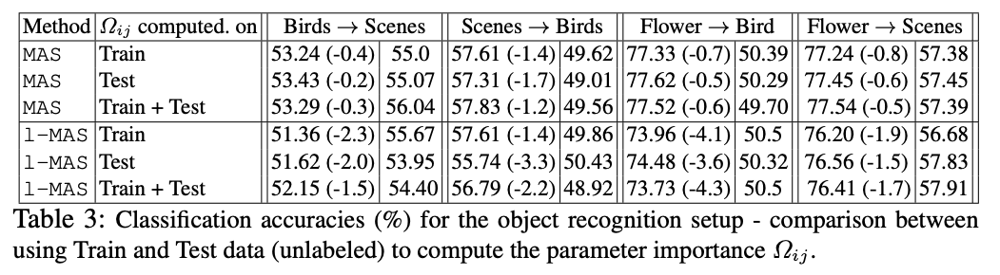
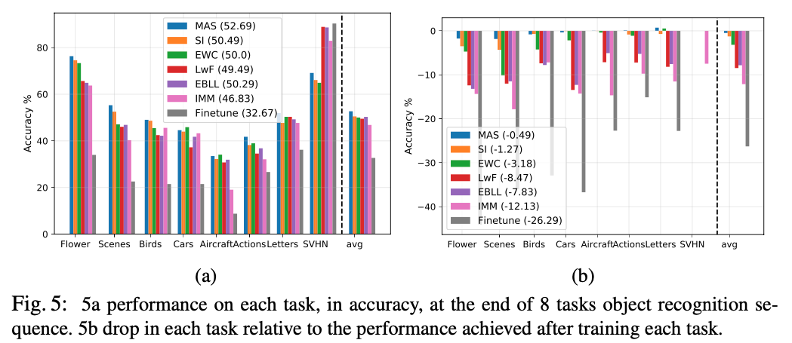
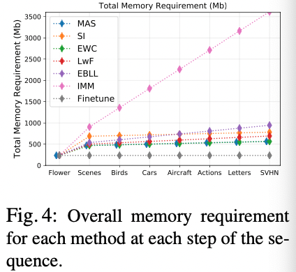

## Memory Aware Synapses: Learning what (not) to forget

### 1、Motivation

如果一个人能够在学习的过程中反复地学习以前学过的东西，那么他会记得更牢。这个过程其实是“将有用的东西记住，没用的东西遗忘”的过程。基于这个直觉，作者认为可以在每一个task到来之前进行一个deployment的操作，使用无标签的数据让模型学会过往的知识那些对他是重要的，从而强化这部分记忆，遗忘不重要的部分。

### 2、Approach

#### 2.1 Estimating parameter importance

对于已经训练好的一个对于输入X可以得到输出Y的函数$\bar F$的估计F，要度量这个函数对改变其参数的敏感度。用这个敏感度表示该参数的重要性。计算方法如下：
$$
F (x_k ; θ + δ) − F (x_k ; θ) ≈ \sum_{i,j} g_{ij} (x_k )δ_{i,j}
\newline
\Omega_{ij}=\frac 1 N \sum^N_{k=1}||g_{ij}(x_k)||
$$
其中$g_{ij}(x_k)=\frac{∂(F(x_k;θ))}{∂θ_{ij}}$。上一个式子是梯度的表示，下面式子是某一参数对所有输入梯度的累加。如果$\Omega_{ij}$比较小，说明其对应的参数对输出的影响不大。反之，如果其比较大，说明在后面的训练中需要将对应的参数保护起来。

#### 2.2 Learning a new task

当第$T_n$个task到来的时候，loss的计算表示为：

在完成新task的训练后，再更新Ω矩阵。这个更新的过程可以在训练完成后的任何时候，因此更为灵活。且不需要label作为监督。实验中超参数$\lambda$设置为1。

#### 2.3 Connection to hebbian learning

**A local version of our method. **

作者将网络看成一系列函数的组合：$F(x)=F_L(F_{L-1}(...(F_1(x))))$。

这样设计就可以局部地保护参数，但是这样设计相比global有什么好处呢？

### 3、Experiment

#### two task experiment

希望的效果是在训练的时候对前面任务对遗忘能够尽可能地小，但在新任务上的准确率又可以尽可能地逼近finetune的效果。

#### Local vs. global MAS on training/test data.

Local version虽然在计算开销上有优势，但是带来的问题是准确率比不上global version。

#### **l2 vs. vector output.**

使用l2速度更快，效果上没有明显的下降。

#### longer sequence

文章的方法不仅在长序列上效果较好而且内存开销也最接近finetune。