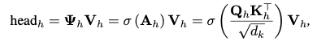

## Meta-attention for ViT-backed Continual Learning

### 1、Motivation

过往的用于CNN的增量学习方法在ViT中并不够适用。

作者设计了一种基于mask method的ViT IL方法。之所以选择mask method，是因为：

1）mask方法为每个task选用特定的参数，因此非常适配IL

2）mask方法对task对顺序并不敏感

3）mask方法避免了昂贵对数据存储开销

基于此，作者设计了Meta-Attention方法。

### 2、Approach

The proposed MEta-ATtention (MEAT) aims to dynamically adapt the standard token interaction pattern to the new tasks via putting attention to self-attention. 

#### 2.1 Attention to Self-attention

原本一个head的self-attention计算方法为：

作者在这里引入了一个mask，在计算的时候掩盖一部分的token，attention的计算方法表示为：

这个过程可以用下图表示。标准的Token interaction中token的信息交互是不受限制的。但adaptied token interaction中，通过mask隐去了部分token之间的交互。

看起来，每个mask是针对task来设计的。但是读到这里有问题：**掩盖一些token 不会掉点吗？以及为什么掩盖token这个方法可行呢？**

在实现上， a binary value MEAT mask is adopted to replace the former continuous value mask. For the token i, a binary variable, the attention entry $m_i$ ∈ {0, 1} modifies its adapted attention state, where 1 and 0 indicate whether token i is activated or not in the adapted token interaction pattern. 这里说是为了避免存储**连续的mask会占用存储空间**，但是。。。。。一个mask能占多少呢。。。

进一步地，基于二值的mask，有：

在此基础上，遇到了一个新问题：**二值的mask在BP的时候没办法更新**。在这里我想到的方法是：**是否可以用一种连续的方法生成二值的mask呢？类似于HAT，基于一个embedding来生成mask**

在这里，作者采用了再参化技巧Gumbel softmax。对于第i个token的mask，作者定义了一个采样分布$t^i\in\R^2$，$t^{i,1}$表示mask的概率。然后使用Gumbel softmax将其转换成可导的形式：
$$
m^i=\frac{exp((log(t^{i,1})+g^1)/\tau)}{\sum^2_{k=1}exp((log(t^{i,k})+g^k)/\tau)}
$$

#### 2.2 Attention to FFN

作者还为FFN设计了attention mask，对FFN的参数$W\in\R^{d_1\times d_2}$的更新进行限制。

这里mask的生成跟上面一致。

#### 2.3 Optimization Objective

除了一般用到的cross entropy loss之外，为了防止过多的token被mask掉造成严重的掉点，作者了另外介绍了一个drop control loss：

这里相当于是定义一个遮盖率来限制遮盖。

最后的loss写为：
$$
L=L_{ce}(\hat p, p)+ \alpha L_{dc}(m)
$$

### 3、Experiment

#### 3.1 Benchmark Comparison

imageNet那一行有一点疑问，为什么其他方法在imageNet上效果不变，ViT backbone 是没有被更新吗？

#### 3.2 Ablation study

##### 3.2.1 Effectiveness of Components

这么看起来，好像对FFN施加mask对效果影响最大？

##### 3.2.2 Comparing to CNNs

使用MEAT的CNNs架构相比其他方法只有一点提升，但是在Transformer上有很显著的增长。