## Prototype Augmentation and Self-Supervision for Incremental Learning

### 1、Motivation

通过存储少量previous task数据的方式放置灾难性遗忘的方法取得了不错的效果，但是其代价是较大的存储开销。

有人提出可以用生成式网络来生成伪数据代替直接存储，但是GAN这样的生成式网络本身就很难训练，而且也存在灾难性遗忘的问题。之前也有exemplar-free的基于正则化的方法，但是这样的方法更适用于task-incremental learning，本文关注的是class-incremental learning这个场景。

同时，也有研究表明train过之前task的网络未必是对当前task的一个好的初始化（甚至不如随机初始化），原因是模型在previous task上过拟合。

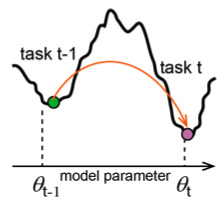

因此，作者希望能够保持CIL的分类边界同时减轻模型在previous task上过拟合的现象。对前者，作者提出了prototype augmentation的方法。对于后者，作者提出使用监督的方法。

### 2、Approach

#### 2.1 Problem statement and analysis

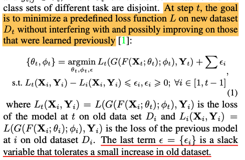

作者设计的模型结构如下所示：

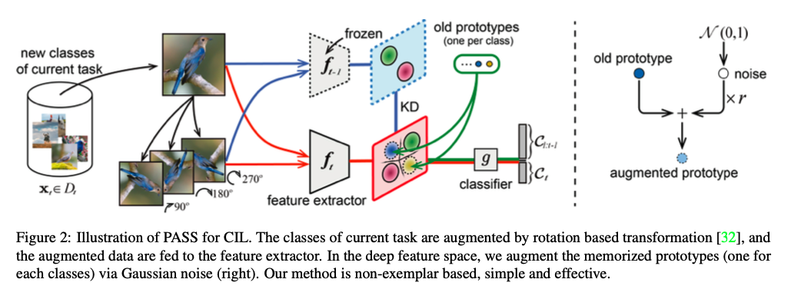

对于旧类别，不存储任何数据，而是存储class-representative prototype。在学习新任务的时候，将这些prototype进行增强后跟新数据的特征一起送入分类器。同时，为了减轻task-level overfitting，预测图片旋转角度对自监督机制也被引入了模型。

#### 2.2 Prototype Augmentation

首先，通过计算旧类别数据特征均值的方式得到旧类别数据的prototype：
$$
μ_{t,k} = \frac 1 {N_{t,k}}\sum^{N_{t,k}}_{n=1}F(X_{t,k};θ_t).
$$
在学习新任务的时候，对旧类别的每个prototype，通过下面式子进行增强：
$$
F_{t_{old} ,k_{old}} = μ_{t_{old} ,k_{old}}+ e ∗ r,
$$
其中e～N(0,1)，r可以被预先定义， 也可以通过计算类别表现的平均方差得到：

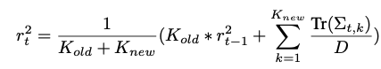

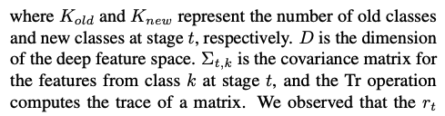

最后，将这些增强过的prototype和新的数据得到的特征一起送入分类器进行分类，最后计算损失如下：

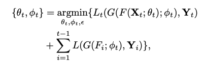

**个人理解：**这样的做法是为了将新类别的数据融合进旧数据的特征空间中。

#### 2.3 SSL based label agumentation

作者将每张新类别的图片分别旋转90，180，270°，最后分类的时候做4分类。

#### 2.4 Integrated Objective of PASS

作者用知识蒸馏的方法，保持模型对新类别数据提取特征的一致：
$$
L_{t,kd} =∥F_t(X'_t;θ_t)−F_{t−1}(X'_t;θ_{t−1})∥
$$
最后模型的训练损失可以写为：

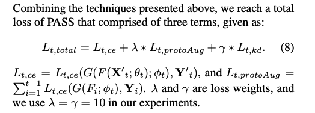

### 3、Experiment

#### 3.1 2D visualization of ProtoAug

首先作者在MNIST上可视化ProtoAug的方法（不含SSL）

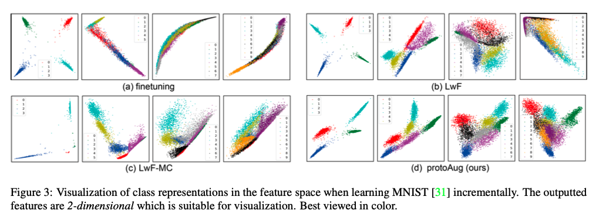

可以发现，ProtoAug可以有效地保持旧类别的分布，从而尽可能减轻CIL中的灾难性遗忘。

#### 3.2  A closer look at SSL for CIL

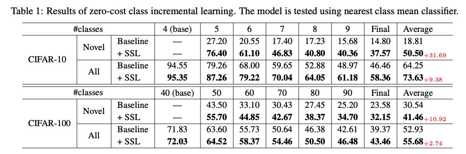

加入SSL以后效果有很明显的提升。

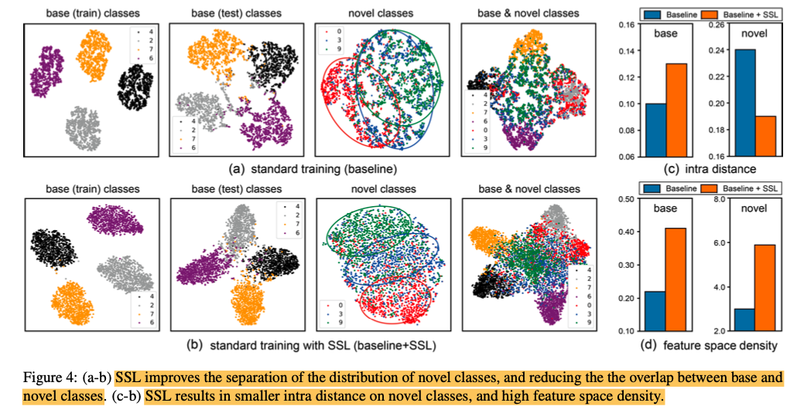

特征的分布也更为分散。

#### 3.3 Comparative results

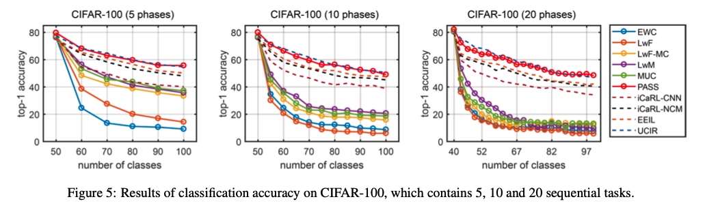

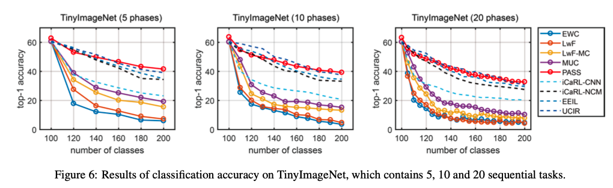

方法的效果远超无回放的方法， 并且在有回放的方法中也取得了很棒的效果。

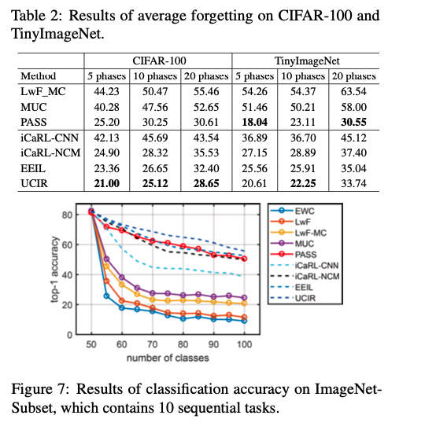

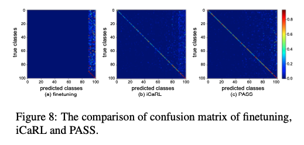

#### 3.4 Ablation study

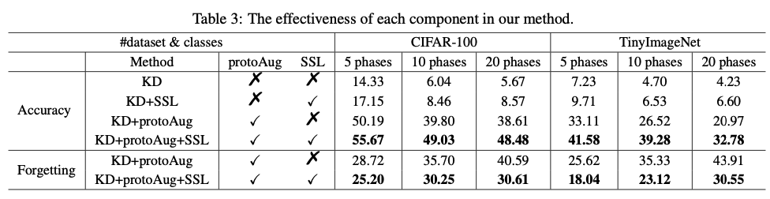