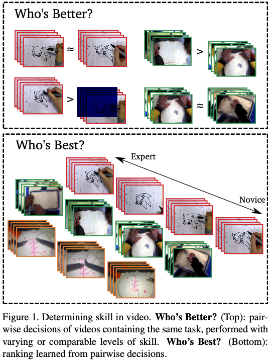
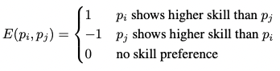
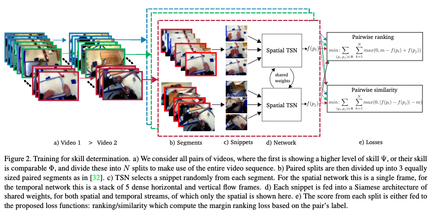
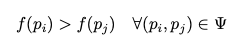
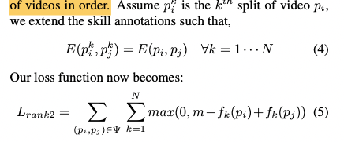
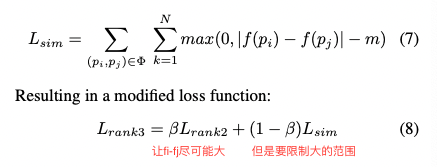

## Who’s Better? Who’s Best? Pairwise Deep Ranking for Skill Determination

### 1、Motivation

skill determination的代表作，目的是为了判断how-to video的动作哪一个做的更好。

### 2、Approach

#### 2.1 problem definition

skill determination并不关心具体的分数，而是更关心两个动作实例之间谁好谁坏。因此对于动作实例i和j，有：

因此，最终只需要预测这一个标签即可。

#### 2.2 Time as a measure of skill

过往的研究发现，一个动作的完成用时可能并不能在众多领域很好地反映技能的好坏，因此需要设计一个独立于完成时间的模型。

#### 2.3 Temporal segment networks as architecture

用TSN来提取特征

#### 2.4 Pairwise Deep Ranking

作者设计了一个孪生网络的结构来完成这一任务。模型的输入是视频对$\Psi=\{(p_i,p_j);E(p_i,p_j)=1\}$，其中i动作比j的表现好。这两个实例通过共享权值的TSN网络后得到$f(p_i)$和$ f(p_j)$。作者的目标是使得：

因此一个可行的损失被设计为：
$$
L_{rank1}=\sum_{(p_i,p_j)\in\Psi}max(0,m-f(p_i)+f(p_j))
$$

#### 2.5 pairwise deep ranking with splits

这里作者分别对每个clip执行了相同的对比（这么做的直觉是认为相同任务的行为在流程上是一致的，因此每个clip都可以做对比。但有个疑问是你怎么知道每个clip都一定比对方做的好？）

最终的loss写成：

#### 2.6 pairwise deep ranking with similarity loss

因为两个动作表现的水平可能会出现相近的情况，因此如果只用前面的loss反而会让模型认为两个动作的水平相去甚远。因此为了限制模型的学习，作者引入了一个对抗损失：

#### 2.7 evaluating skill for a test video

这一块被几个概念弄的有点晕：split、segment、clip、snippet。需要阅读代码

实验结果方面因为这是比较早的文章所以就不在笔记里放了，可以直接看文章，还挺容易理解的。

这种不关注得分本身而更关注ranking的方法可能更适合现实生活。

