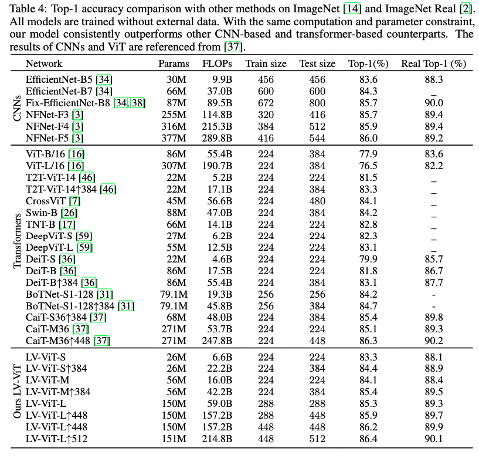

## All Tokens Matter: Token Labeling for Training Better Vision Transformers

### 1、Motivation

过往的ViT训练策略大多是只用图片尺度的稀疏标签来作为监督，这使得ViT不太好训练。过往的研究中、发现合理地应用局部信息可以有效地提升模型的表现。因此作者提出使用一个已经训练好的优质Expert来对token赋予伪标签，实现密集监督。

这一方法相比DeiT提出的蒸馏方法，最大的优势在于tokens的伪类标可以线下获取，可以极大程度减少训练时的计算开销，

### 2、Approach

#### 2.1 revisiting vision transformer

经典的ViT将图片分割成一系列小的patches，用一个linear层将这些patches映射成tokens，再与一个cls token拼接起来。最后用transofmer block输出的cls token接入一个分类头完成图片分类。

这样设计最大的问题是忽略了由patches 编码得到的丰富信息。

#### 2.2 Token labeling

token labeling认为每个token对应的顶层输出与底层patch对应的类别有关。并应用了tokens的丰富信息。

因此，每张图片的GT label包含两部分：k维图片类标$y^{cls}$和N个k维score map $[y^1,...,y^N]$（N为patch tokens的数量）。

用H表示交叉上损失，使用token labeling策略的损失函数可表示为：

$\beta$为超参数。在实验中，作者将其设为0.5。

**优势分析：**

- token labels不需要online 生成，可以提前完成。相比知识蒸馏，这样可以大幅度降低计算开销。
- dense prediction rather than sparse prediction
- pretrained models with token labeling benefit downstream tasks with dense prediction

#### 2.3 Token labeling with MixToken

先来看几种数据增强方法：

如果直接使用CutMix，那么有些patch将会既存在原图的信息，也存在另一张用来mix的图片信息。这在进行token labeling的时候，很难赋予一个准确的label。

为了解决这个问题，作者提出了MixToken的方法。对于两一张图片$I_1,I_2$，以及他们对应的token labels $Y_1=[y_1^1,...,y_1^N], Y_2=[y_2^1,...,y_2^N]$，首先将图片通过patch embedding module得到各自的token信息：$T_1=[T_1^1,...,T_1^N], T_2=[T_2^1,...,T_2^N]$。然后使用下面的式子处理T和Y：
$$
\hat T=T_1 \odot M + T_2\odot (1-M)
\newline
\hat Y=Y_1 \odot M + Y_2\odot (1-M)
$$
其中$\odot$表示逐元素相乘，M表示binary mask，生成方式参照提出Cutmix的paper。

而图片的label被表示为：
$$
\hat {y^{cls}}=\bar My_1^{cls}+(1-\bar M)y_2^{cls}
$$
其中$\bar M$是M所有元素的均值。

### 3、Experiment

**dataset：**ImageNet

**machine annotator：**NFNet-F6 ——576x576_**in** + 18x18x1000_**out**，另外使用RoIAlign辅助训练，存储时只存粗top5而不是1000d

#### 3.1 Ablation study

**default settings：**

**mixtoken & data augmentation：**

**all tokens matter：**

randomly drop some tokens and use the remaining ones for computing the token labeling loss. 

**Robustness to different ViT variants：**

token labeling对其他的transformer架构也有效

#### 3.2 Comparison to other methods

