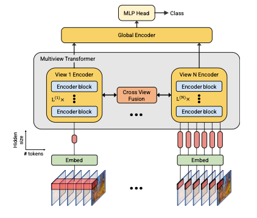
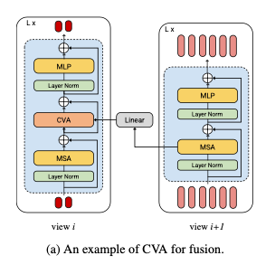
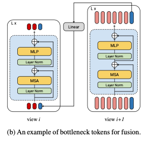
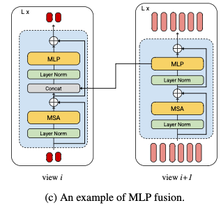
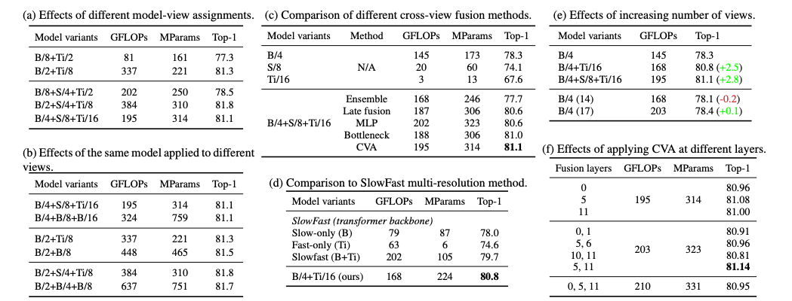
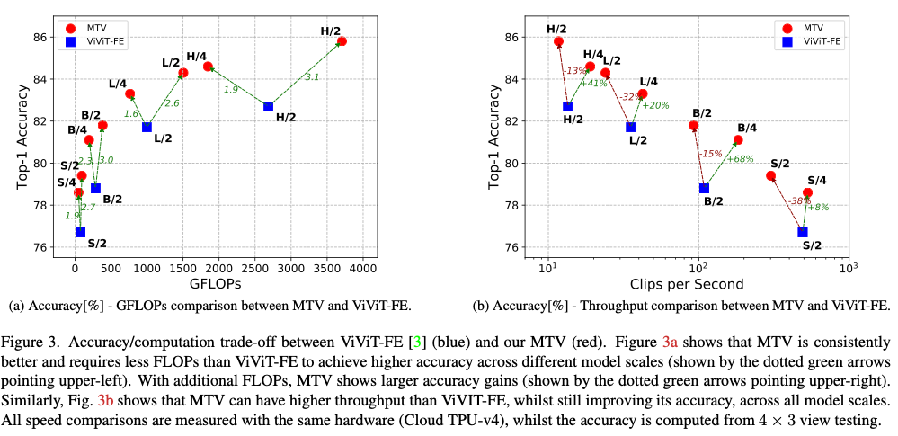
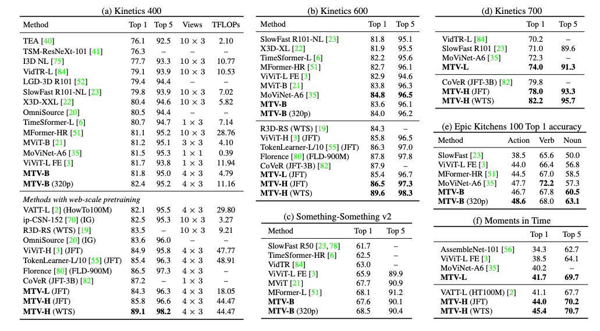

## Multiview Transformers for Video Recognition

### 1、Motivation

在过往的视频理解方法中，时空信息常常因为pooling或下采样的操作而丢失。

作者提出了一种基于transformer的架构用于捕获多multi-resolution时间上下文的信息。从long segments中提取到的tokens中包含场景的主旨（如事件发生的背景），从short segments中提取到的tokens中包含了细粒度动作信息（如姿态信息。）

### 2、Apporach

#### 2.1 multi-view tokenization

传统的transformer只提取一组token $z^0=[z_{cls},Ex_1,Ex_2,...,Ex_N]+p$，而在这篇文章中，作者提取了多组tokens：$z^{0,(1)},z^{0,(2)},...,z^{0,(V)}$，作为不同的views，其中V为views的数量，而$z^{l,(i)}$表示第i组tokens通过了l层transformer以后得到的结果。

作者使用了不同的3D卷积核和不同层数的网络来提取tokens。越小的卷积核将得到越多tokens的view

#### 2.2 multi-view transformer

首先将不同组的tokens分别通过属于自己的一个encoder，每个encoder中间设置了一个cross view fusion模块。完成encode以后将得到的信息再通过global encoder实现特征融合

**①multiview encoder**

对每个view有不同的encoder，每个encoder block就是一个基本的transformer模块，不同的是其中加入了一个cross view fusion模块。

**②cross-view fusion**

作者提出了三种不同的fusion策略：

1. cross-view attention(CVA)：将不同tokens的views按照token数量从小到大排序。cross-view fusion将在每对i和i+1个view上进行。更新策略如下：
   $$
   z^{(i)}=CVA(z^{(i)},W^{proj}z^{(i+1)})
   \newline
   CAV(x,y)=Softmax(\frac{W^QxW^Ky^T}{\sqrt{d_k}})W^Vy
   $$
   

2. Bottleneck tokens：这种方法需要在第i个view中引入B^i个bottleneck token，这里的B^i远小于对应view中tokens的数量。完成i+1个view的encode以后，将bottleneck token做projection以后concat到第i个view输入token的最后。这个方法要注意的是需要从包含最多tokens的view开始向前进行。

   

3. MLP fusion：这种比较简单，直接看图就可以理解了。

   

### 3、Experiment

本文的实验setting跟vivit基本一致。所以需要去读那篇文章。

模型命名规则：

For example, B/2+S/4+Ti/8 denotes a three-view model, where a “Base”, “Small”, and “Tiny” encoders are used to processes tokens from the views with tubelets of sizes 16×16×2,16×16×4,and16×16×8,respectively

#### 3.1 Ablation study

#### 3.2 Comparison to the SOTA

