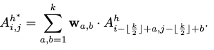

## Refiner: Refining Self-attention for Vision Transformers

### 1、Motivation

许多近期针对ViT的工作集中于设计更复杂的结构或者设计训练策略来提升ViT的性能，而很少关注基础的self-attention结构。

传统的SA中，每个token都要和其他所有token计算相似度并根据相似度将values叠加，这样每个token可以充分交换信息。但带来的问题是可能会导致tokens变得越来越像，导致ViT效果不够好。因此，作者希望针对这一问题，提出相应的解决方案。

作者想了两个解决方案，1. 增加SA的头数，增强attention map的离散程度同时引入attention expansion保证送入每个head的embedding足够；2. 引入局部信息，让token可以对附近位置的token施加更多关注

虽然思路简单，但是效果看起来还不错。

### 2、Refiner

#### 2.1 Limitations of ViTs

作者认为缺少归纳偏置的原始ViTs的feature演进速度比CNN慢，并用实验证明了这一点。

作者认为可以通过让attention maps更不同以及让其感知局部信息来解决这一问题。

**这个观察特征演进的方法可以学一下**

#### 2.2 Attention Expansion

对于MHSA的头大数量，首先有这样的直觉：

Increasing the number of attention heads within MHSA, which is shown to be effective at improving the model performance, can potentially increase diversity among the attention maps. 

If naively adding more SA heads, for a model with fixed hidden dimension, it is difficult to trade-off the benefit of having more SA heads and the harm of reducing the embedding dimension per head.

为了平衡这两点，作者采用linear transformation 来实现self-attention map的拓展。

**原始的ViT**计算方法：

**Extension**方法：

用linear projection $W_A ∈ \R^{H^′×H}$将$A[A^1,...,A^H]$映射到更多头的版本$\tilde{A}=[\tilde{A}^1,...,\tilde{A}^H]$
$$
\tilde A^h =\sum ^H_{i=1}W_A(h,i)·A^i,h=1,...,H'
$$

#### 2.3 Distributed Local Attention

这个部分跟过往对特征施加卷积的方法不同的地方在于，其直接对self attention map加卷积。

对计算得到的某个头h的attention map $A^h$，在其上采用一个可学的k x k卷积：

然后用这个新的attention map跟v计算得到SA的输出。

此外，作者证明了这样的操作与对feature做局部操作等价。

**这个真的可以学！**

#### 2.4 Linear reduction

为了减少计算开销并保持embedding 维度的一致，在与V相乘前，还需要进行跟expension类似的linear reduction操作将头数降下来。

综上，Refiner的结构可以被描述为下图：

### 3、Experiment

#### 3.1 Ablation study

**Effect of attention expansion**

随着expansion ratio的增加，模型的param没发生大的改变，但是可以更快收敛到更好的结果。

**Effect of attention reduction**

加入reduction以后效果有所下降，但这是可以理解的，不过我觉得这里可以做一个关于计算开销和参数量的对比验证reduction 很好地做到了accuracy-computation trand-off。

**Effect of distributed local attention**

**Effect of the local attention kernels**

**Refiner augments attention maps and accelerates feature evolving**

**这个实验要学着怎么去做**

