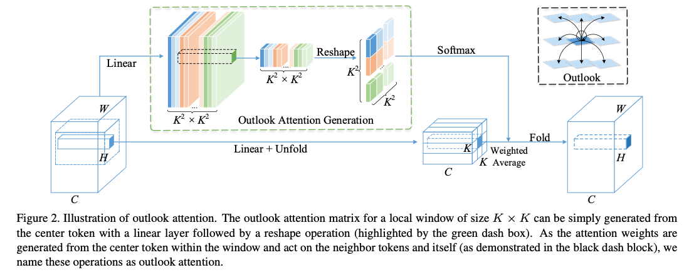
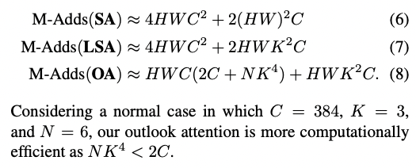
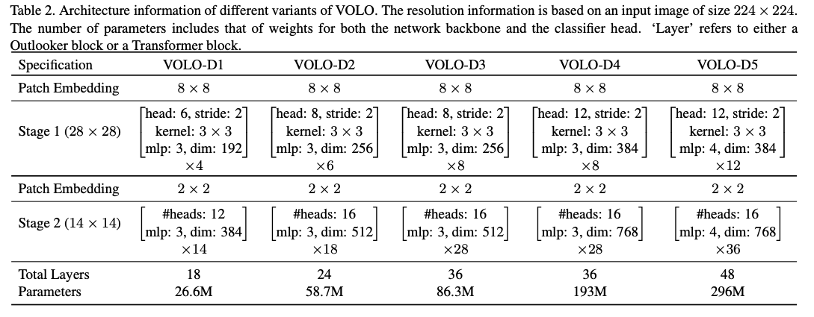
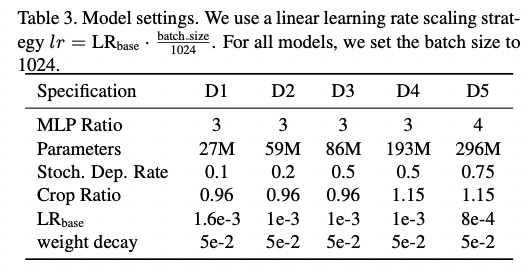

## VOLO: Vision Outlooker for Visual Recognition

### 1、Motivation

虽然ViT很nice，但是脱离了大规模数据集效果会不如CNN。这是因为ViT无法建模细粒度的上下文特征。因此作者提出了vision outlooker来解决这个问题。

### 2、Apporach

#### 2.1 Outlooker

outlooker包含了一个用于编码空间信息的outlook attention层和用于融合channel information的MLP。对于一个输入$X\in\R^{H*W*C}$，用公式表示：
$$
\widetilde X = OutlookAtt(LN(X)) + X
\newline
Z = MLP(LN(\widetilde X )) + \widetilde X
$$
**①outlook attention**

该模块有两个基本的insights：

1) the feature at each spatial location is representative enough to generate attention weights for locally aggregating its neighboring features; 
2) the dense and local spatial aggregation can encode fine-level information efficiently.

对于模块输入X空间上的每个点，outlook attention计算其与临近K*K的窗格中各个点之间的相似度。具体的计算方法为：

1. 对于输入$X\in H*W*C$，用$W_A ∈ \R^{C×K^4}$和$W_V ∈ \R^{C×C}$将输入分别映射成outlook weight： $A\in\R^{H*W*K^4}$和value representation：$V\in\R^{H*W*C}$。并用$V_{△i,j}=\{V_{i+p-[\frac K 2],j+q-[\frac K 2]}\}$来表示点i，j对应的local window，其中0≤p,q≤K。
2. 对于一个点(i,j)，从A中取出对应的$K^4$维向量并reshape成$K^2 * K^2$的注意力矩阵$\hat A_{i,j}$，与$V_{△i,j}$做矩阵乘法。$Y_{△i,j}=MatMul(Softmax(\hat A_{△i,j}),V_{△i,j})$
3. 最后将local window中计算的Y值融合得到输出：$\widetilde Y_{i,j}=\sum_{0≤m,n<K}Y_{△i+m−⌊ \frac K 2⌋,j +n−⌊\frac K 2⌋}$

**具体如何实现需要看代码。不过这部分其实有一个疑问：outlooker模块中的attention weight生成是对一个点对应的向量做linear projection得到的，为什么可以表征周围部分的权值呢？**

**②multi-head outlook attention**

这个基本上跟传统的multihead attention一致，可以直接看论文。

**③discussion**

作者描述了outlooker的三大优点：①计算了token之间的相似度；②使用slide window去建模细粒度的局部关系；③用reshape的简单的projection代替了self attention的KQV模式，减少的计算量。

#### 2.2 Network Architecture Variants

这里的patch embedding用的是卷积。

### 3、Experiment

**setup：**

感觉数据增强很重要。同时有一些超参数的设计也很值得学习。

具体的实验结果不在此处阐述了，需要的话看一下paper吧。

遗留问题：

①上面提到的关于权值生成的问题

②为什么VOLO比swin transformer好？

