## Dual-stream-network-for-visual-recognition

### 1、Motivation

transformer具有很强的全局建模能力，但是缺乏捕获局部模式的能力。为了解决这一问题作者提出了可以计算细粒度特征并高效融合的dual stream network。

过往的工作有许多将CNN引入Transformer来提升局部建模能力的方法。（CvT中将linear projection换成CNN，ContNet在token maps上做卷积）但这存在一些问题：1、卷积-注意力交替或将linear换成卷积的操作可能不够好；2、CNN和attention功能上的冲突可能会影响训练效果；3、attention不一定能在高分辨率的feature map上很好地捕获信息；4、纯attention的计算复杂度很高，降采样降低复杂度的操作也丢失了一部分局部信息。

### 2、Approach

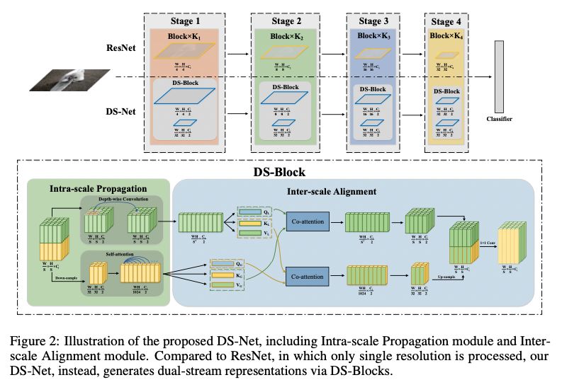

#### 2.1 overview

看完整体框架以后感觉其思路是沿用downsample的方式，将self-attention作用的分辨率控制在1/32 of the image降低计算复杂度并捕获global信息，而用dw卷积作用于更高的分辨率，捕获local信息。然后接一个co-attention模块实现跨尺度信息的融合。

**比较好奇的是down sample是怎么做的，以及每个stage 的channel size如何确定。**

#### 2.2 Intra-scale propagation

将当前stage的输入feature map分成$f_l和f_g$两部分，该模块具体实现如下：

**local representation**

对于$f_l\in\R^{W_i × H_i × C_l}$，用3 x 3 DW卷积提取局部特征

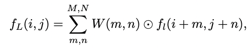

**这个地方原文对公式的表述可以学一下的。**

**global representation**

首先将$f_g$ flatten 到 $l_g= \frac W {32} × \frac H {32}$长度，然后对之采用self-attention。

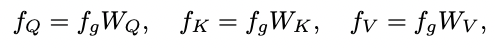

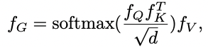

其中$d=\frac {\frac {C_i} {2}} N$，N是self-attention的头数

#### 2.3 Inter-scale Alignment

之所以需要有这样的一个模块，是因为作者发现global feature和local feature所关注的内容并不匹配，简单地将其融合（concatenation、element-wise addition和production）可能无法捕获两者的深层关系。

首先将获取的$f_L$拉平成时序特征，然后采用下面的方式实现特征融合：

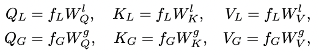

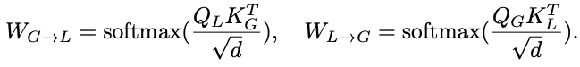

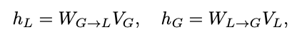

这个地方比较容易理解，值得注意的是两个co-attention模块的参数并不共享。

#### 2.4 dual-stream feature pyramid network

Previous methods often cause large extra memory and computation costs, due to their complicated architectures and utilized high resolution feature maps

同时，全局的nonlocal又会丢失一些局部信息导致小物体检测效果不好。

因此，作者将dual-stream的设计引入FPN

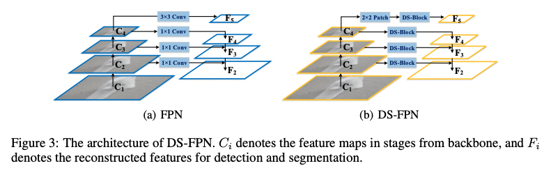

### 3、Experiment

三种结构：

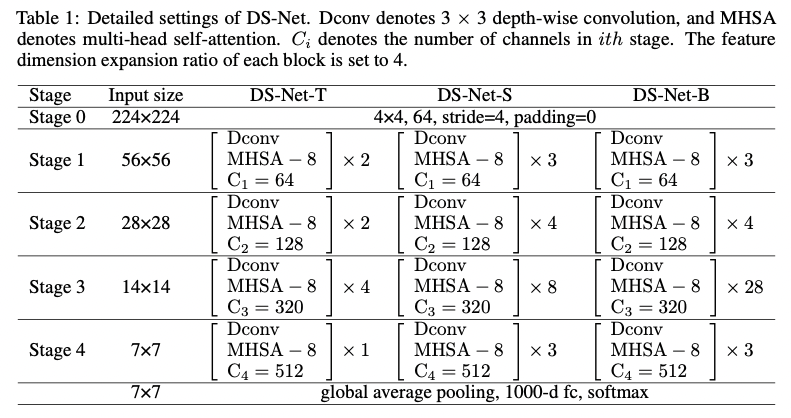

#### 3.1 Ablation study

##### 3.1.1 ratio of local to global feature

在前面的描述中，input feature被均匀分成两部分送入两个stream，如果不平衡地送入不同的stream会怎么样呢？

When α equals 0, only depth-wise convolution is performed, and when α equals 1, only self-attention is performed.

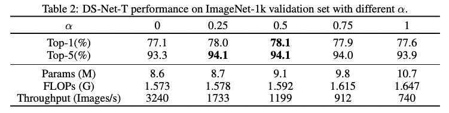

##### 3.1.2 none is dispensable in DS-Block

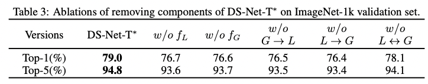

#### 3.2 Image classification

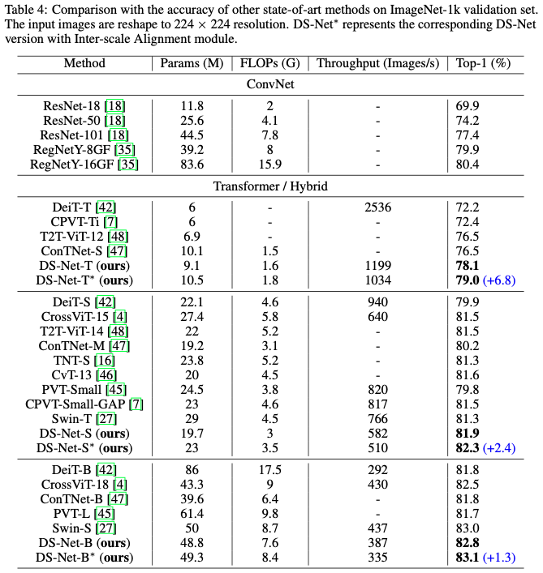

这里的DS-Net-B是没有Inter-scale -Alignment module的网络，带*的则是有的