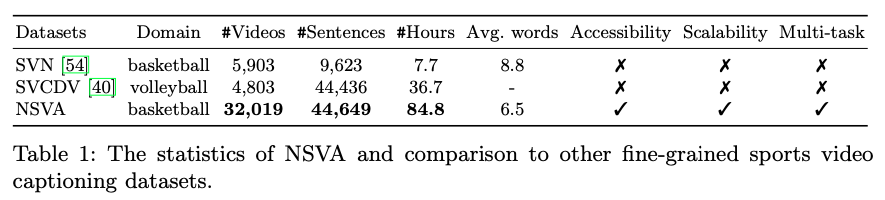
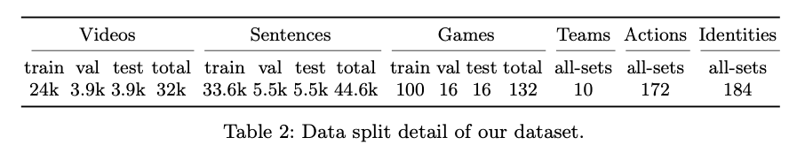
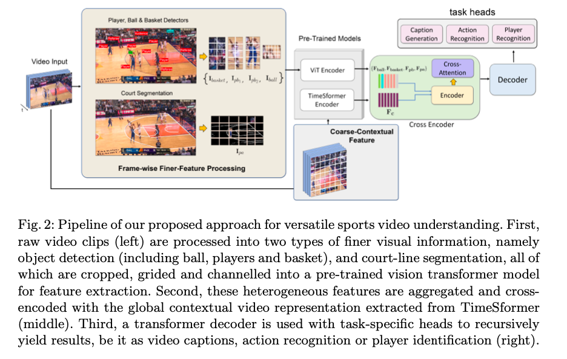
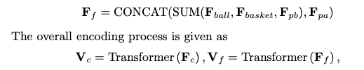

## Sports Video Analysis on Large-Scale Data

### 1、Motivation

过往的video captioning的工作主要面临着三个限制：1）繁重的人工标注工作限制了数据集的大小；2）过往的工作没有开源数据集；3）现有方法在推理的时候经常忽略人们看视频时真正感兴趣的部分。

基于这三个limitation，作者收集了一个更大、更全的数据集NSVA。可以用作video captioning、finegrained action recognition和video re-id

### 2、NSVA

### 3、Architecture

这里作者用TimeSformer提取视频特征，用ViT提取球、篮框和运动员和三分线的特征，得到这些特征以后通过一个Transformer encoder进一步提取信息：

在此之后，使用一个Transformer构建整个场景和细粒度patch之间的关系(cross attention)：
$$
M=Transformer(CONCAT(V_c,V_f))
$$
最后，用一个Transformer Decoder生成caption。当然也可以将decoder用于其他任务。

